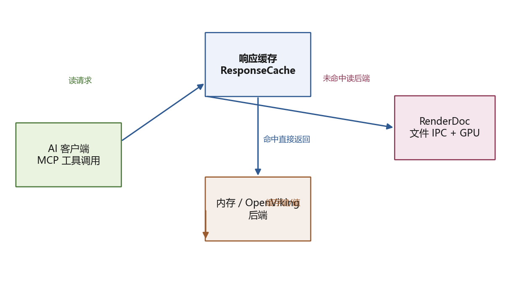
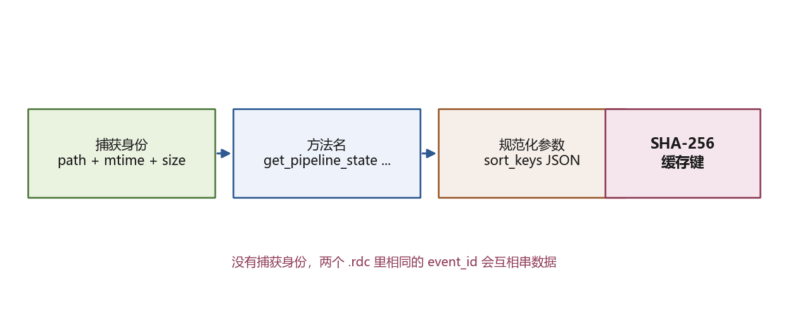
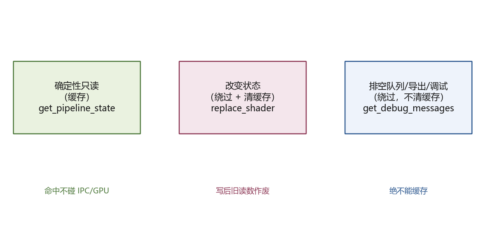

# 给 RenderDoc 的 MCP 工具加缓存，别把缓存塞进 Python 3.6 扩展里

图形调试里最贵的从来不是"读一次数据"，而是"同一个问题，被 AI 反复问两次"。

RenderDoc 的 MCP 服务器把每一次工具调用都写成 `request.json`，轮询等 `response.json`，再走进 RenderDoc 的 `BlockInvoke` 去碰 GPU、重放、取纹理。这套链路没有一层响应缓存。于是智能体第 N 次问"事件 7538 的管线状态是什么"，和第 1 次一样付全价。

给这套东西加缓存，第一反应通常是：在循环里加个字典，记住结果。但真正要回答的是三件事——缓存键怎么定、什么该失效、缓存放在哪一侧。

这篇文章用一次真实改造说明一个判断：**缓存不是"记住答案"，而是给昂贵读取加一道有边界的旁路。** 边界错了，缓存越快，错得越快。

## 先把两个代码库摆清楚

一边是 `OpenViking`，一个面向智能体的上下文数据库。它在这里能提供两样东西：轻量的 `openviking_sdk.SyncHTTPClient`，一个可以 `mkdir`、`write`、`read_raw`、`rm` 的持久化 `viking://` 文件系统；以及它自己用的 RAGFS `CachedFileSystem`，一个读穿透、带失效与命中统计的缓存实现。前者解决"缓存落在哪里"，后者是"缓存该怎么写"的范本。

另一边是 `renderdoc` 里的 `RenderDocMCP`，一个约六十个工具、全走桥接调用的 MCP 服务器。它的现状是：没有任何响应缓存，也没有 OpenViking 依赖。

最重要的约束是进程边界：`mcp_server/` 跑标准 Python（≥ 3.10），而 `renderdoc_extension/` 跑 RenderDoc 内嵌的 Python 3.6、只能 import 标准库。缓存如果放进扩展那一侧，立刻把现代 Python 和第三方 SDK 带进一个解析不了它们的环境。

所以结论很直接：**缓存只放 MCP 侧。** 这也顺带避免了"为了缓存，去动一个已经能跑、但每次改动都要重装扩展并重启 RenderDoc 的分量"。

## 缓存键 = 捕获身份 + 方法名 + 规范化参数

最容易犯的错，是只拿 `event_id` 或 `ResourceId` 当键。两个不同的 `.rdc` 里，`event_id=7538` 或 `ResourceId::56` 完全可能是不同的东西。

这里的键由三段拼起来：

捕获身份不是文件名，而是文件名加上 `stat` 出来的 mtime 和大小。这样同一个路径被覆盖、换了内容，键也会跟着变。参数先 `sort_keys` 再序列化成 JSON，保证传参顺序不影响命中。

捕获身份从 `get_capture_status().filename` 来。这个调用必须绕开缓存，否则缓存会为了定位自己去查自己，而且它每次返回的是"当前捕获"，值得用一次轻量 IPC 换正确的键。

## 三类调用，三种处理

不是所有工具都能一视同仁。

第一类是确定性只读，比如 `get_pipeline_state`、`get_texture_data`、`get_frame_summary`、`list_resources`。这些走读穿透：命中返回，未命中调后端再写回。

第二类会改变当前捕获或它的替换关系，比如 `replace_shader`、`replace_resource`、`write_section`、`open_capture`。这些绕过缓存，成功后清空整个缓存。因为一次替换之后，之前所有"读管线状态"的结果都可能已经失效。

第三类最容易被误缓存，也最危险：`get_debug_messages` 每次会排空消息队列，缓存它等于把已消费的消息反复回放；`export_texture` 是写文件；`debug_pixel` 是单步调试。它们绕过缓存，但不清缓存。

这三类的边界，比"缓存命中率"更值得写进文档。

## OpenViking 是可选项，不是硬依赖

后端默认是进程内内存，一个带 TTL 和条目上限的字典。它零依赖，测试也最快。

把 `RENDERDOC_MCP_CACHE_BACKEND=openviking` 打开时，条目会被持久化到 `viking://resources/renderdoc-mcp-cache/<key>.json`，跨进程、跨智能体存活。这里有两个细节值得单独说：

- 写入用 `processing_mode="vectors_only"`，因为缓存值是透明 JSON，不需要语义抽取。
- 读回用 `read_raw`，拿原始字节，避免把缓存当成"要再解析一遍的内容"。

`openviking_sdk` 是懒加载。装不上、连不上，后端报告不可用，缓存透明退回内存。对 MCP 服务器来说，缓存永远不该成为启动失败的根因。

## 两道自评审拦下的坑

写完代码后自评审，又拦下两个实现层面的问题，比一开始列出的九条风险更具体：

一个是最初把捕获身份做成了短时缓存。测试暴露出：捕获换掉之后，旧身份还留着，键就错了。改法是**每次调用都重新从 `get_capture_status` 推导身份**，不省这一个小 IPC。

另一个是 OpenViking 后端的 `clear()` 删掉整个基础目录后，内部 `_ready` 标志还停在真，下一次 `put` 就不再重新建目录。改法是清理后把就绪标志复位。

这两件事的共同点：**缓存失效逻辑的正确性，比命中路径的性能更重要。** 命中快是加分项，键错了、失效漏了，是错误项。

## 能搬走的，是这三条判断

文件路径会随仓库改名，具体实现会重写，但判断可以带走：

1. **缓存放昂贵读取的前面，别放数据生产者的内部。** 对 RenderDoc 来说，就是放 MCP 侧，而不是 Python 3.6 扩展里。
2. **缓存键要携带身份，不只是查询参数。** 跨文件、跨会话的读取，身份不在键里就一定会串数据。
3. **先给"读、写、排空队列"分类，再谈命中率。** 排空队列、导出、调试类工具，绕过去比缓存它更安全。

缓存的价值不在它省了多少次 GPU 调用，而在它敢不敢在边界处说"这条可以直接返回"。敢说，是因为键和失效语义是对的。

## 想对照源码

- `docs/openviking-cache-design.md` —— 设计 + 九点自评审
- `mcp_server/cache.py` —— `ResponseCache` / `MemoryBackend` / `OpenVikingBackend`
- `mcp_server/config.py`、`mcp_server/server.py` —— 环境变量接线
- `tests/test_cache.py` —— GPU 无关的单元测试
