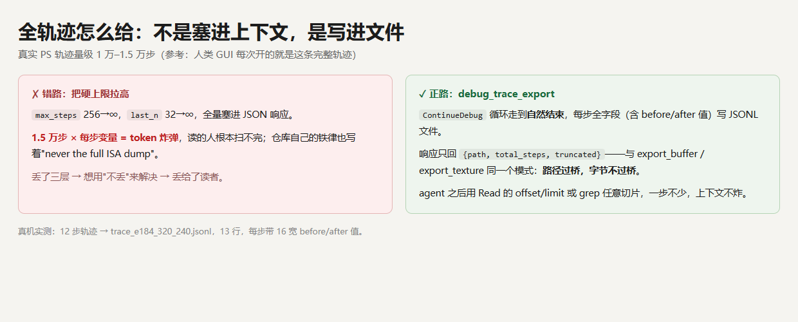
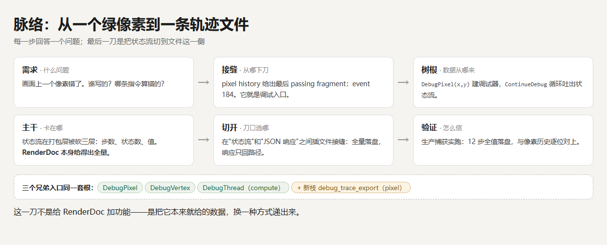
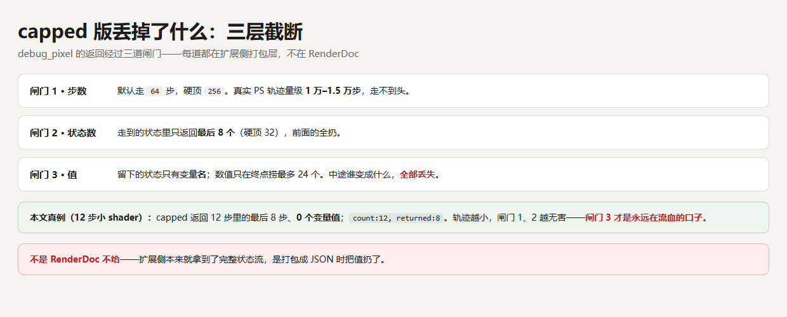
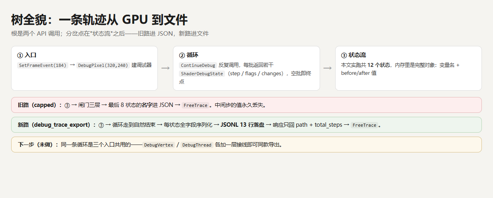
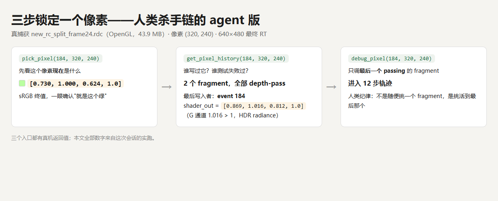
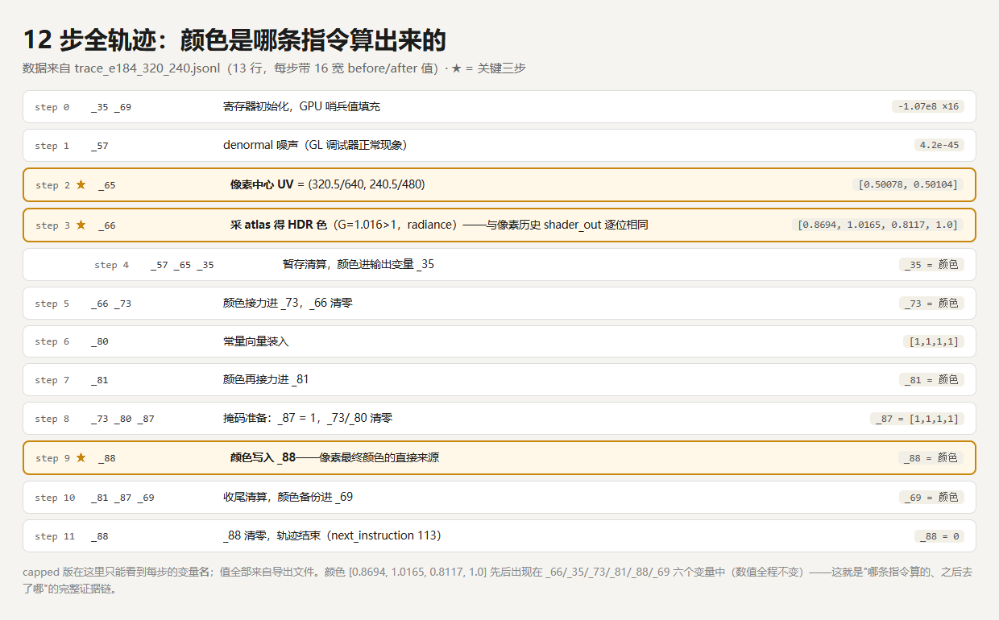
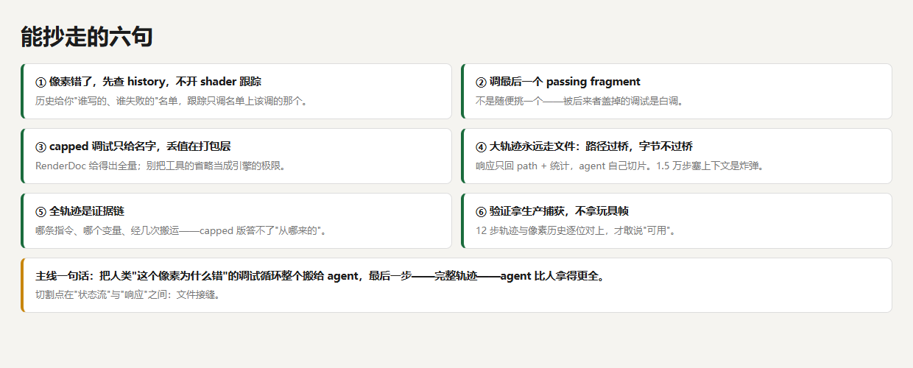

# 一个像素错了怎么查？我把人类的 GPU 调试杀手链教给了 AI

> TL;DR
>
> - 像素错了，先查 pixel history（谁写过、谁测试失败），再只调**最后一个通过测试**的 fragment——这是人类图形程序员的三步杀手链。agent 版：`pick_pixel` → `get_pixel_history` → `debug_pixel`。
> - 真机已验证：一帧 43.9 MB 的生产捕获（OpenGL）上三连全通，调出的 12 步轨迹与像素历史**逐位对上**。
> - 老版调试接口只回变量**名**、不回值——丢值发生在工具的打包层，不是 RenderDoc 的极限。
> - 新工具 `debug_trace_export`：完整轨迹逐状态写进 JSONL 文件，响应只回路径和统计。轨迹就算 1.5 万步也不炸上下文。
> - 拿到全轨迹，才能回答老版答不了的问题：**这个像素的颜色是哪条指令算出来的、中间经了几次搬运。**

[作者补一句：……]

## 为什么做这件事：验证哪条能力

上面这帧画面，重活只有 9 个 GPU 动作：7 个 compute dispatch（一个叫 reference_transport 的算法跑了 C0 到 C5 六级，加一次 final 消费）加 2 个 draw call，前后再各有一次 clear 和 present。捕获文件 43.9 MB，API 是 OpenGL，最终渲染目标 640×480。

我们维护的这套工具让 AI agent 能打开 .rdc 做调试，之前已经验证过读帧、查管线、改 shader 重放这些能力。这次要验证的是最难的那条：**人类 90% 调试循环里的杀手锏——单像素调试——agent 能不能完整跑通？并且在"完整调试轨迹"这一步，能不能比人类拿得更全？**

选生产捕获当考题，不选玩具帧：这帧是某个全局光照算法的真实基线，任何"可用"的结论都带生产级证据。

## 第一反应多半是错的

轨迹给不全，直觉解法是把上限拉高：`max_steps` 从 256 放开，`last_n` 从 32 放开，一股脑塞进响应。

错。真实像素着色器轨迹的量级是 **1 万到 1.5 万步**（参考值，来自 RenderDoc 社区的实践记录，非本例实测；本例的 PS 恰好只有 12 步）。1.5 万步乘上每步的变量表，是一颗 token 炸弹——就算模型吞得下，读的人也扫不完。把"丢数据"修成"丢给人看"，问题没解决。

正路是把刀口换位置：**轨迹写成文件，响应只回路径。** 这不是新发明，同一个工具箱里的 `export_buffer`、`export_texture` 早就是这个模式——路径过桥，字节不过桥。agent 拿到路径后用 Read 的 offset/limit 或 grep 任意切片，一步不少，上下文不炸。

## 脉络：从"这个像素绿得不对"到一条轨迹文件

顺着走一遍，每步回答一个问题：

- **需求**：画面上一个像素错了。谁写的？哪条指令算错的？
- **接缝**：pixel history 给出嫌疑名单，名单上最后一个通过测试的 fragment 就是调试入口。
- **树根**：RenderDoc 的调试数据流就两个调用——`DebugPixel(x, y)` 建调试器，`ContinueDebug` 循环吐出状态流，空批即终点。
- **主干**：状态流在工具的打包层被砍了三刀（下一节）。
- **切开**：在"状态流"和"JSON 响应"之间插一个文件接缝，全量落盘。

## 三层截断：丢的不是 RenderDoc 给不起的东西

老版 `debug_pixel` 的返回经过三道闸门：

1. **步数**：默认走 64 步，硬顶 256。
2. **状态数**：走到的状态里只返回最后 8 个（硬顶 32）。
3. **值**：留下的状态只有变量名；数值只在终点捞最多 24 个。

前两道闸门是防炸的保险丝，第三道才是流血的口子——中途某个变量从什么变成什么，全部丢失。而这三道闸门都在扩展侧的打包代码里：**RenderDoc 本来就给得出完整状态流，是打包成 JSON 时把值扔了。**

所以新工具 `debug_trace_export` 做的事很简单：同一个 `ContinueDebug` 循环，走到自然结束（或指定步数），每个状态全字段序列化成 JSONL——第一行是 header（事件号、坐标、阶段），之后每行一个状态，每步的每次变量改动都带完整的 before/after 值。响应里只有 `{path, total_steps, truncated}` 和异常摘要。

顺带说一句树的结构：这条循环是 `DebugPixel` / `DebugVertex` / `DebugThread` 三个入口共用的，本次只接了 pixel 这一根枝——compute 调试（那 7 个 dispatch 用的）要的是 `DebugThread` 入口，接线留待下次。

## 杀手链真机跑通

回到那帧画面。假设中心像素 (320, 240) 绿得不对，人类的查法是三步：

**第一步，pick。** 读这个像素现在的值：`[0.730, 1.000, 0.624, 1.0]`（sRGB）。

**第二步，pixel history。** 问这个像素"一生中被谁写过"。返回：2 个 fragment，全部通过了深度测试。最后写入者是 event 184 的那次 draw，它的 shader 输出是 `[0.8694, 1.0165, 0.8117, 1.0]`——注意 G 通道 1.016，大于 1，这是 HDR 辐射值，写进 sRGB 目标时被压成 0.730。

**第三步，debug。** 只调 event 184 这一个 fragment（人类纪律：调活到最后的那个，调被盖住的是白调）。

三步全部在真机上返回了真实数据。顺带一个交叉验证：另一份优化前的捕获在同一坐标的同一 fragment 上，shader 输出和这份**逐位相同**——两帧捕获本身互为旁证。

## 12 步全轨迹：颜色是哪条指令算出来的

`debug_trace_export` 落盘的文件共 13 行：1 行 header + 12 个状态，每个变量改动都带 16 宽的 before/after 值。把 12 步摆开，这个像素的一生就讲完了：

- **step 2**：`_65` 变成 `[0.50078, 0.50104]`——这正是像素中心 UV（320.5/640, 240.5/480），浮点存下来就是这两个数。
- **step 3**：`_66` 变成 `[0.8694, 1.0165, 0.8117, 1.0]`——拿这个 UV 去采级联 atlas，采回了 HDR 颜色。这个值和 pixel history 记录的 shader 输出**逐位一致**，两条独立证据链在这里咬合。
- **step 4 到 step 10**：这个颜色先后出现在五个变量里——`_35`（step 4）、`_73`（step 5）、`_81`（step 7）、`_88`（step 9），step 10 再备份进 `_69`。全程数值不变。
- **step 11**：`_88` 清零，轨迹走完。

老版只回变量名的时候，你看到 step 3 动了 `_66`，但不知道它变成了什么、从哪来。全轨迹版本能指着具体一步说：**颜色是这一步采出来的，之后原样出现在五个变量里，没有被任何计算改变。** 如果这个像素颜色错了，嫌疑范围立刻缩到 step 3 的采样及其上游。

顺便，这就是采样发生的地方——捕获里命名过的 C0 级级联 atlas（1024×512），GPU 上真实存在的纹理，不是示意图。

## 收获和结论

1. **像素错了先查 history，不要先开 shader 跟踪。** 历史给你"谁写的、谁失败的"名单；跟踪只调名单上该调的那个。
2. **调最后一个 passing fragment。** 不是随便挑一个——被后来者盖掉的调试是白调。
3. **capped 只给名字，丢值在打包层。** 别把工具的省略当成引擎的极限；动手前先分清数据丢在哪一层。
4. **大轨迹永远走文件：路径过桥，字节不过桥。** 响应只回 path 和统计，agent 自己切片。这是一切"大对象过桥"的通用切法。
5. **全轨迹是证据链。** 哪条指令、哪个变量、经几次搬运——没有它，"这个像素为什么错"只能猜。
6. **验证拿生产捕获。** 12 步轨迹与像素历史逐位对上，才敢说"可用"；玩具帧给不出这种咬合。

把开头的主线再说一遍：把人类"这个像素为什么错"的调试循环整个搬给了 agent——pick、history、调试三步全部真机跑通；而最后一步，完整调试轨迹，文件接缝让 agent 比人类在 GUI 里看到的还要全：每一步、每个变量、每一次搬运的值，都在。你要搬走的不是某个工具名，是这把刀的切法——在数据流和展示层之间切一刀，大头放文件，小头过接口。

**讨论口：** 如果是你的系统，1.5 万步的轨迹会怎么喂给模型——像本文一样全量写文件让 agent 自己切片，还是先给摘要、按需展开某几步？切片粒度（按步、按变量、按"颜色出现的第一次"）你切在哪？评论区聊聊。

**PS.** 只带走一句的话：丢数据的时候，先问数据死在哪一层——引擎层、打包层还是展示层。三层修法完全不同。

**PPS.** 最容易混的邻概念：这不是"AI 看图找 bug"。全程没有一个像素被"看"——读的是数值、历史和轨迹，和人类读 GUI 窗口是同一份底层数据。

**PPPS.** 时效声明：基于 RenderDoc（OpenGL 后端）加一套自建 MCP 桥，2026-08 真机验证。Vertex/Thread 入口的导出还没接；GL 后端的调试器有个小怪癖——变量名挂在改动的 before 上而不是 after 上，value 空名时先查 before。
