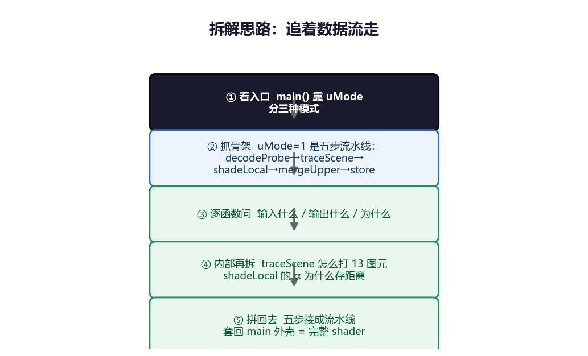
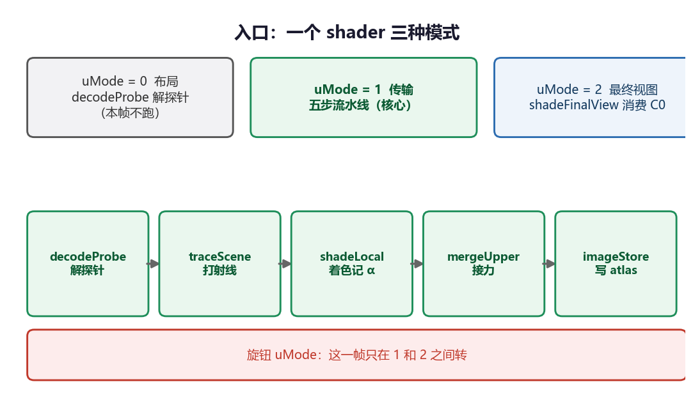
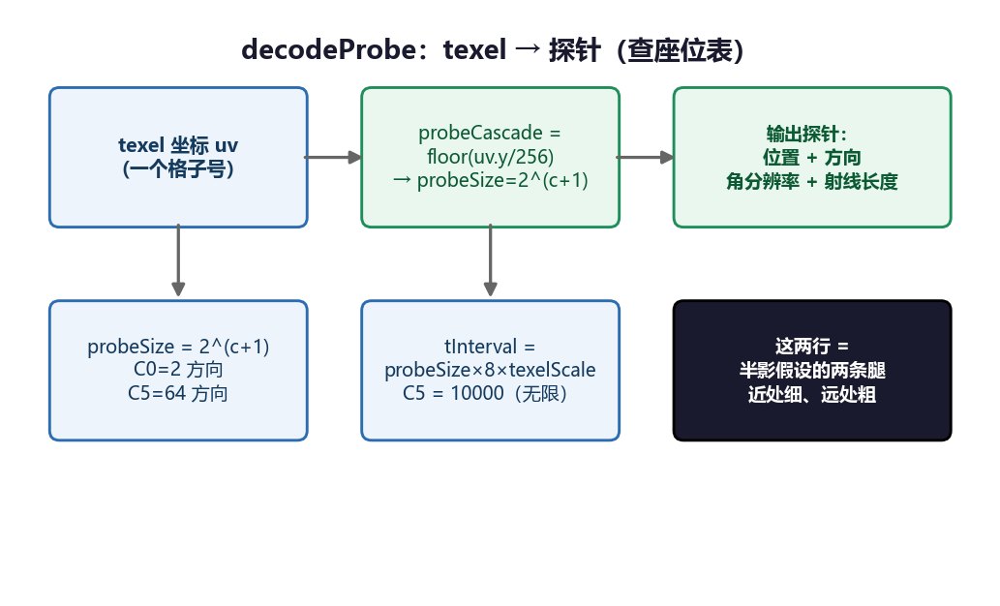
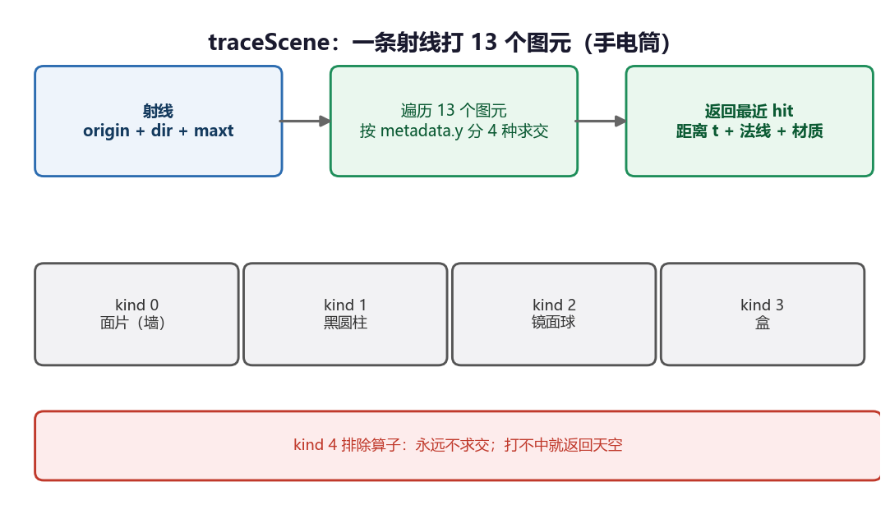
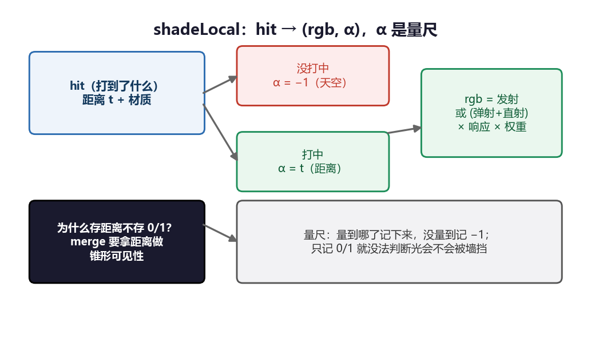
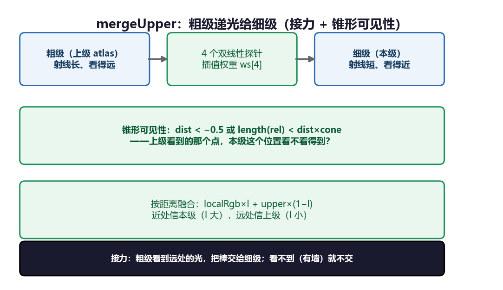
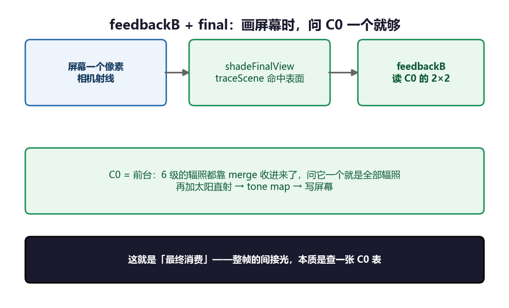
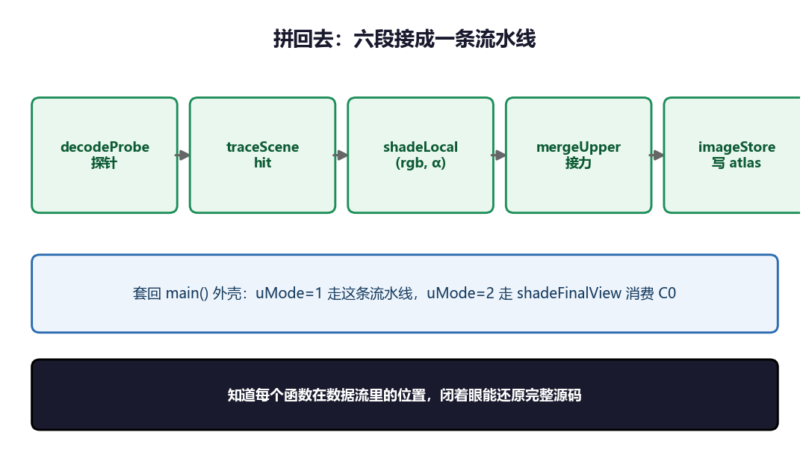
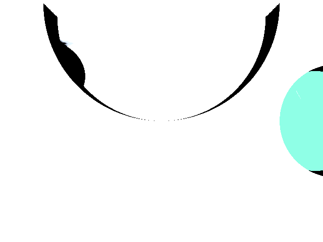
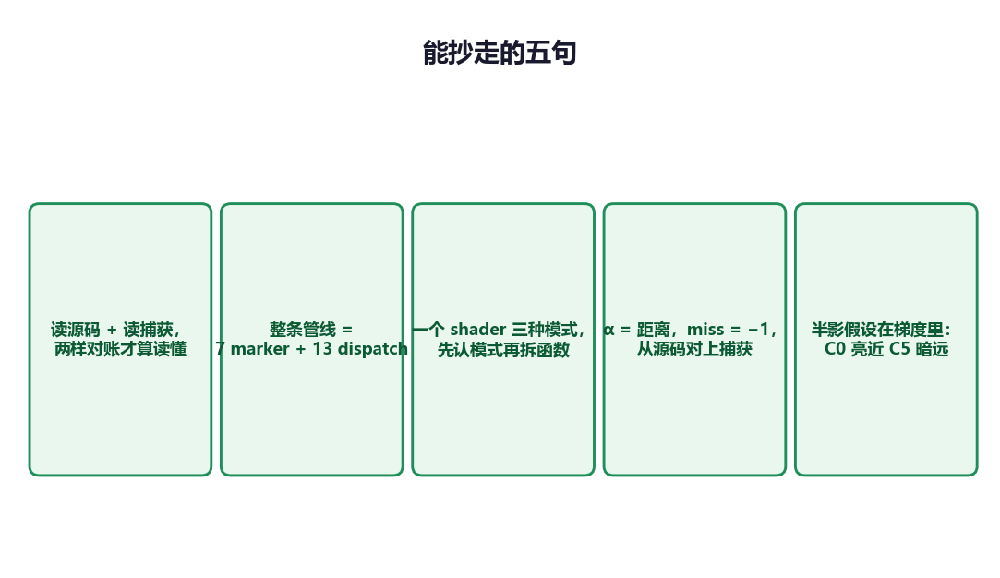

# 逆向 Radiance Cascades：先给你完整源码，再跟着我的思路一段段拆

**TL;DR**

- 这一篇不写说明文，写我的拆解思路。先放完整 shader 源码（26 KB，从 `.rdc` 里取出的原文），再沿着一条线把它拆成六段，每段配一张图，最后拼回去。
- 拆解思路只有一句话：**追着数据走**。先看入口 `main()`，它分三种模式；核心是 `uMode=1` 的五步流水线，逐个函数问「输入什么、输出什么、为什么」。
- 六段是：入口三种模式 → decodeProbe 解探针 → traceScene 打射线 → shadeLocal 记距离 → mergeUpper 接力 → feedbackB 消费。
- 每个难懂的地方配比喻：atlas 是底片、decodeProbe 是查座位、traceScene 是手电筒、α 是量尺、merge 是接力赛。
- 最后改两行验证：C0 写红全屏红、去 merge 全屏曝白。两下把数据流钉死。

---

## 我的拆解思路

先讲清楚我怎么拆，你跟着走就不会迷路。

这个 shader 是**数据驱动**的：场景全在一个 SSBO 里，算法等于「数据怎么流」。所以拆法就是**追着数据流走**，五步：

1. **看入口** `main()`——它靠 `uMode` 分三种模式，这一帧只跑 `uMode=1`（传输）和 `uMode=2`（最终视图）。
2. **抓骨架**——`uMode=1` 的核心是一条五步流水线：`decodeProbe → traceScene → shadeLocal → mergeUpper → imageStore`。
3. **逐个函数问**——每个函数「输入什么、输出什么、为什么」。
4. **函数内部再拆**——比如 `traceScene` 怎么遍历 13 个图元、`shadeLocal` 的 α 为什么存距离。
5. **拼回去**——把五步流水线接起来，套回 `main()` 的三模式外壳，就是完整 shader。



后面每一段，我都会扣着这条线：这一段在流水线的哪个位置、输入什么、输出什么。

---

## 完整源码

这是 `get_shader_source` 从 `.rdc` 里取出的原文（`is_source_text: true`，26743 字节）。先放全貌，下面按六段拆。

```glsl
#version 430

// Unified reference surface-RC transport kernel. Data-driven: the scene
// contract SSBO (charts, primitives, materials, header) defines the layout and
// geometry, so one shader serves any scene. Mirrors the CPU oracles.
//
// Primitive kinds (metadata.y):
//   0 = charted quad, 1 = black uncharted cylinder, 2 = mirror sphere,
//   3 = diffuse/reflective box, 4 = exclusion operator (never intersected).

layout(local_size_x = 8, local_size_y = 8, local_size_z = 1) in;

struct LayoutRecord { vec4 probePos; vec4 probeDir; vec4 angles; vec4 weights; vec4 misc; };
struct TransportRequest { vec4 origin; vec4 ray; vec4 hit0; vec4 hit1; vec4 misc; };

layout(std430, binding = 0) readonly buffer Requests { vec2 requestUv[]; };
layout(std430, binding = 1) writeonly buffer Records  { LayoutRecord records[]; };
layout(std430, binding = 4) readonly buffer TransportRequests { TransportRequest trequests[]; };
layout(std430, binding = 5) writeonly buffer TransportRecords { vec4 trecords[]; };
layout(rgba32f, binding = 2) uniform writeonly image2D uBandImage;

struct GpuMaterial { uvec4 metadata; vec4 response; vec4 emission; };
struct GpuChart { uvec4 metadata; uvec4 resolutionAndBase; vec4 originAndExtentU;
                  vec4 tangentAndExtentV; vec4 bitangentAndTexelScaleU; vec4 normalAndTexelScaleV; };
struct GpuPrimitive { uvec4 metadata; vec4 data0; vec4 data1; vec4 data2; vec4 data3; };

layout(std430, binding = 3) readonly buffer SceneData {
    uvec4 identity; uvec4 counts; uvec4 lightIds;
    vec4 roomBoundsMin; vec4 roomBoundsMax;
    vec4 referenceConstants;  // x=time, y=texelScale
    vec4 sunDirection; vec4 sunRadiance; vec4 skyParameters;
    vec4 largeOpening; vec4 smallOpening;
    GpuMaterial materials[8]; GpuChart charts[8]; GpuPrimitive primitives[13];
} scene;

uniform int uMode;           // 0 = layout, 1 = band transport, 2 = final view
uniform int uCascade;
uniform int uRequestCount;
uniform sampler2D uUpperCascade;
uniform int uEnableUpperMerge;
uniform sampler2D uFeedbackC0;
uniform int uHistoryValid;
uniform int uRefEnabled;
uniform int uWidth; uniform int uHeight;
uniform int uPhysicalWidth; uniform int uPhysicalHeight;
uniform int uLayoutRequest;
uniform vec3 uCamPos; uniform vec3 uCamFwd; uniform vec3 uCamRight; uniform vec3 uCamUp;
uniform float uCamTan; uniform float uAspect; uniform float uExposure; uniform float uInvGamma;
uniform float uC0Log2Offset = 0.0;
uniform ivec2 uDispatchOrigin = ivec2(0);

const float THETA_PI = 3.14192653;
const float PI       = 3.141592653;
const float C5_REACH = 10000.0;
const int MAT_DIFFUSE = 0; const int MAT_BLACK = 1; const int MAT_REFLECTIVE = 2;
const int MAT_EMISSIVE = 3; const int MAT_SKY = 4;

// Global -> physical mapping. Two-page parity layout (primary y<1536, interior y>=1536).
vec2 globalToPhysicalF(int cascade, vec2 globalUv) {
    float bandY0 = 256.0*float(cascade);
    if (globalUv.y >= bandY0 && globalUv.y < bandY0 + 256.0)
        return vec2(globalUv.x, globalUv.y - bandY0);
    if (globalUv.y >= 1536.0 + bandY0 && globalUv.y < 1536.0 + bandY0 + 256.0)
        return vec2(globalUv.x, globalUv.y - (1280.0 + bandY0));
    return vec2(-1.0);
}

vec2 rotate2(vec2 p, float ang) { float c = cos(ang); float s = sin(ang);
    return vec2(p.x*c - p.y*s, p.x*s + p.y*c); }
vec2 repeat2(vec2 p, float n) { float ang = 2.0*3.141592653/n;
    float sector = floor(atan(p.x, p.y)/ang + 0.5); return rotate2(p, sector*ang); }
float dfBox(vec2 p, vec2 b) { vec2 d = abs(p - b*0.5) - b*0.5;
    return min(max(d.x, d.y), 0.0) + length(max(d, vec2(0.0))); }
bool interiorOpening(vec3 p) {
    if (length(p.xy - scene.largeOpening.xy) < scene.largeOpening.z) return true;
    if (length(p.xy - scene.smallOpening.xy) < scene.smallOpening.z) return true;
    return false; }
bool dfIntersection(vec3 p, float t) {
    GpuPrimitive ex = scene.primitives[12];
    float nt = 1.0 + t*0.2;
    vec3 rp = p - vec3(ex.data0.x, 0.5, ex.data0.z);
    vec2 rep = repeat2(rp.xz, 8.0);
    float r = length(rp.xz);
    if (p.y > 0.49 && abs(p.z - 0.5) > 0.04 && r < 0.2 && abs(r - 0.1375) > 0.01 &&
        dfBox(vec2(rep.x + 0.01, rep.y - 0.015), vec2(0.02, 0.3)) > 0.0) return true;
    return false; }

struct TraceHit { float t; vec3 position; vec3 normal; int chartId; vec2 chartUv;
                  int materialKind; vec3 response; vec3 emission; bool hit; };

void applyMaterial(inout TraceHit h, uint materialId) {
    for (int m = 0; m < 8; ++m)
        if (scene.materials[m].metadata.x == materialId) {
            h.materialKind = int(scene.materials[m].metadata.y);
            h.response = scene.materials[m].response.xyz;
            h.emission = scene.materials[m].emission.xyz;
            return; }
    h.materialKind = MAT_DIFFUSE; h.response = vec3(0.0); h.emission = vec3(0.0); }

// ---------- 片段 3：traceScene ----------
TraceHit traceScene(vec3 origin, vec3 dir, float maxt, float time) {
    TraceHit h;
    h.t = maxt; h.position = origin + dir * maxt; h.normal = vec3(0.0);
    h.chartId = 0; h.chartUv = vec2(-1.0);
    h.materialKind = MAT_SKY; h.response = vec3(0.0); h.emission = vec3(0.0); h.hit = false;
    bool hasExclusion = scene.primitives[12].data0.x != 0.0;
    bool hasOpenings = scene.largeOpening.z > 0.0;
    for (int i = 0; i < 13; ++i) {
        GpuPrimitive prim = scene.primitives[i];
        uint kind = prim.metadata.y;
        if (kind == 0u) {
            // charted quad: plane intersect + dfBox + exclusion/opening gate
            uint chartId = prim.metadata.w & 0xffu;
            vec3 chartN = prim.data3.xyz;
            vec3 planeN = (prim.metadata.w & 0x100u) != 0u ? -chartN : chartN;
            bool tieOverride = (prim.metadata.w & 0x200u) != 0u;
            vec3 rel = origin - prim.data0.xyz;
            vec3 tan = prim.data1.xyz; vec3 bit = prim.data2.xyz;
            vec2 pSize = vec2(prim.data1.w, prim.data2.w);
            float norDot = dot(planeN, dir); float pDot = dot(planeN, rel);
            if (norDot * pDot < 0.0) {
                float t = -pDot / norDot;
                vec3 hp = rel + dir * t;
                vec2 hit2 = vec2(dot(hp, tan), dot(hp, bit));
                float limit = tieOverride ? h.t + 0.0005 : h.t;
                if (dfBox(hit2, pSize) <= 0.0 && t > -0.5 && t < limit) {
                    vec3 wp = origin + dir * t;
                    bool excluded = false;
                    if (chartId <= 6u && hasExclusion && dfIntersection(wp, time)) excluded = true;
                    if (chartId >= 7u && hasOpenings && interiorOpening(wp)) excluded = true;
                    if (!excluded) {
                        h.t = t; h.position = wp; h.normal = chartN;
                        h.chartId = int(chartId); h.chartUv = hit2 / pSize;
                        applyMaterial(h, prim.metadata.z); h.hit = true; } } }
        } else if (kind == 1u) {
            // black uncharted cylinder (parity scene)
            vec3 sp = origin - vec3(prim.data0.xy, 0.0); float radius = prim.data1.x;
            float dxy2 = dot(dir.xy, dir.xy);
            float a = (dot(sp.xy, sp.xy) - radius*radius)/dxy2;
            float b = 2.0*dot(sp.xy, dir.xy)/dxy2;
            float re = b*b*0.25 - a;
            if (re > 0.0) {
                float st = -b*0.5 + sqrt(re);
                float z = sp.z + dir.z*st;
                if (st > 0.0 && st < h.t && z >= prim.data0.z && z <= prim.data0.w) {
                    vec2 radial = sp.xy + dir.xy*st;
                    h.t = st; h.position = origin + dir*st;
                    h.normal = -normalize(vec3(radial, 0.0));
                    h.chartId = 0; h.chartUv = vec2(1.0);
                    h.materialKind = MAT_BLACK; h.response = vec3(0.0); h.emission = vec3(0.0); h.hit = true; } }
        } else if (kind == 2u) {
            // mirror sphere (parity scene)
            vec3 sp = origin - prim.data0.xyz; float radius = prim.data0.w;
            float a = dot(sp, sp) - radius*radius; float b = 2.0*dot(sp, dir);
            float re = b*b*0.25 - a;
            if (dot(sp, dir) < 0.0 && re > 0.0) {
                float st = -b*0.5 - sqrt(re);
                if (st > -0.5 && st < h.t) {
                    h.t = st; h.position = origin + dir*st; h.normal = normalize(sp + dir*st);
                    h.chartId = 0; h.chartUv = vec2(1.0);
                    h.materialKind = MAT_REFLECTIVE; h.response = vec3(0.0); h.emission = vec3(0.0); h.hit = true; } }
        } else if (kind == 3u) {
            // box
            vec3 sp = origin - (prim.data0.xyz + prim.data1.xyz)*0.5;
            vec3 sd = normalize(dir); vec3 idir = 1.0/sd;
            vec3 bmin = prim.data0.xyz - (prim.data0.xyz + prim.data1.xyz)*0.5;
            vec3 bmax = prim.data1.xyz - (prim.data0.xyz + prim.data1.xyz)*0.5;
            vec3 tMn = (bmin - sp)*idir; vec3 tMx = (bmax - sp)*idir;
            vec3 t1 = min(tMn, tMx); vec3 t2 = max(tMn, tMx);
            vec3 signdir = -(max(vec3(0.0), sign(idir))*2.0 - 1.0);
            vec3 sn;
            if (t1.x > max(t1.y, t1.z)) sn = vec3(signdir.x, 0.0, 0.0);
            else if (t1.y > t1.z) sn = vec3(0.0, signdir.y, 0.0);
            else sn = vec3(0.0, 0.0, signdir.z);
            vec2 bb = vec2(max(max(t1.x, t1.y), t1.z), min(min(t2.x, t2.y), t2.z));
            if (bb.x > 0.0 && bb.y > bb.x && bb.x < h.t) {
                h.t = bb.x; h.position = origin + dir*bb.x; h.normal = normalize(sn);
                h.chartId = 0; h.chartUv = vec2(1.0);
                applyMaterial(h, prim.metadata.z); h.hit = true; }
        }
        // kind 4 = exclusion operator, never intersected
    }
    return h;
}

float transportWeight(float thetaIndex, float probeSize) {
    float theta = thetaIndex/probeSize*THETA_PI;
    float binCount = 4.0 + 8.0*floor(thetaIndex);
    float saw = (cos(theta - PI/probeSize) - cos(theta + PI/probeSize))/binCount;
    return saw*cos(theta); }

void chartInfo(uint chartId, out vec2 res, out vec2 base) {
    res = vec2(0.0); base = vec2(0.0);
    for (int i = 0; i < 8; ++i)
        if (scene.charts[i].metadata.x == chartId) {
            res = vec2(scene.charts[i].resolutionAndBase.xy);
            base = vec2(scene.charts[i].resolutionAndBase.zw); return; } }

// ---------- 片段 6：feedbackB ----------
vec3 feedbackB(TraceHit h) {
    if (!h.hit || h.chartId == 0 || h.chartUv.x < 0.0) return vec3(0.0);
    vec2 res, base; chartInfo(uint(h.chartId), res, base);
    float c0Size = pow(2.0, 1.0 + uC0Log2Offset);
    vec2 cell = res / c0Size;
    vec2 suv = clamp(h.chartUv*cell, vec2(0.5), cell - 0.5) + base;
    ivec2 sz = textureSize(uFeedbackC0, 0);
    vec3 sum = vec3(0.0); int n = int(c0Size + 0.5);
    for (int j = 0; j < n; ++j) for (int i = 0; i < n; ++i) {
        vec2 phys = globalToPhysicalF(0, suv + vec2(float(i), float(j))*cell);
        sum += textureLod(uFeedbackC0, phys / vec2(sz), 0.0).rgb; }
    return sum; }

// ---------- 片段 4：shadeLocal ----------
vec4 shadeLocal(TraceHit h, vec3 probeDir, float thetaIndex, float probeSize, vec3 bounce) {
    float w = transportWeight(thetaIndex, probeSize);
    vec3 rgb; float alpha;
    if (!h.hit) {
        alpha = -1.0;
        rgb = scene.skyParameters.xyz * (1.0 - probeDir.y * scene.skyParameters.w);
    } else {
        alpha = h.t;
        rgb = vec3(0.0);
        if (h.materialKind == MAT_EMISSIVE) {
            rgb = h.emission;
        } else if (h.materialKind == MAT_DIFFUSE && dot(h.normal, probeDir) < 0.0) {
            vec3 direct = vec3(0.0);
            float ndl = dot(h.normal, scene.sunDirection.xyz);
            if (ndl > 0.0) {
                vec3 sPos = h.position + h.normal*0.001;
                TraceHit shadow = traceScene(sPos, scene.sunDirection.xyz, 10000.0, scene.referenceConstants.x);
                if (!shadow.hit) direct = scene.sunRadiance.xyz * ndl; }
            rgb = (bounce + direct) * h.response; } }
    return vec4(rgb * w, alpha); }

// ---------- 片段 5：mergeUpper ----------
vec3 mergeUpper(vec2 uv, vec3 gPos, vec3 gTan, vec3 gBit, vec2 gRes,
                float probeCascade, vec3 probePos, float localT, vec3 localRgb) {
    float texelScale = scene.referenceConstants.y;
    float probeSize = pow(2.0, probeCascade + 1.0);
    float upperProbeSize = probeSize*2.0;
    vec2 probePositions = gRes/probeSize;
    vec2 uvo = probePositions*0.5;
    vec2 modUV = mod(uv, gRes);
    vec2 luvo = floor(uv/gRes)*gRes + vec2(0.0, 256.0);
    vec2 luvd = floor(modUV/probePositions)*probePositions;
    vec2 p = clamp(mod(modUV, probePositions)*0.5, vec2(0.5), uvo - 0.5);
    vec2 f = fract(p - 0.5);
    vec2 base = floor(p - 0.5) + 0.5;
    vec2 offs[4] = vec2[4](vec2(0.0), vec2(1.0, 0.0), vec2(0.0, 1.0), vec2(1.0));
    float ws[4] = float[4]((1.0-f.x)*(1.0-f.y), f.x*(1.0-f.y), (1.0-f.x)*f.y, f.x*f.y);
    int uc = int(probeCascade) + 1;
    vec3 numerator = vec3(0.0); float vw = 0.0;
    for (int i = 0; i < 4; ++i) {
        vec2 q = clamp(base + offs[i], vec2(0.5), uvo - 0.5);
        vec3 wp = gPos + gTan*(q.x*upperProbeSize*texelScale) + gBit*(q.y*upperProbeSize*texelScale);
        vec3 rel = probePos - wp;
        float theta = (upperProbeSize*0.5 - 0.5)/(upperProbeSize*0.5)*PI*0.5;
        float cone = cos(PI*0.5 - theta);
        float phi = atan(-dot(rel, gTan), -dot(rel, gBit));
        float count = 4.0 + 8.0*(upperProbeSize*0.5 - 1.0);
        float phiI = floor((phi/PI*0.5 + 0.5)*count) + 0.5;
        float phiLen = upperProbeSize - 1.0;
        vec2 phiUv;
        if (phiI < phiLen) phiUv = vec2(upperProbeSize-0.5, upperProbeSize-phiI);
        else if (phiI < phiLen*2.0) phiUv = vec2(upperProbeSize-(phiI-phiLen), 0.5);
        else if (phiI < phiLen*3.0) phiUv = vec2(0.5, phiI-phiLen*2.0);
        else phiUv = vec2(phiI-phiLen*3.0, upperProbeSize-0.5);
        vec2 lookG = luvo + luvd + floor(phiUv)*uvo + q;
        ivec2 sz = textureSize(uUpperCascade, 0);
        float dist = textureLod(uUpperCascade, globalToPhysicalF(uc, lookG) / vec2(sz), 0.0).a;
        bool visible = dist < -0.5 || length(rel) < dist*cone + 0.01;
        if (visible) {
            vec2 radBase = luvo + luvd + q;
            vec2 radOffs[4] = vec2[4](vec2(0.0), vec2(uvo.x, 0.0), vec2(0.0, uvo.y), uvo);
            vec3 sum = vec3(0.0);
            for (int j = 0; j < 4; ++j)
                sum += textureLod(uUpperCascade, globalToPhysicalF(uc, radBase + radOffs[j]) / vec2(sz), 0.0).rgb;
            numerator += sum*ws[i]; vw += ws[i]; } }
    vec3 upper = numerator / max(0.01, vw);
    float baseT = texelScale*probeSize*1.5;
    float mn = probeCascade < 0.5 ? 0.0 : baseT;
    float interval = probeCascade < 0.5 ? baseT*2.0 : baseT;
    float l = 1.0 - clamp((localT - mn)/interval, 0.0, 1.0);
    return localRgb*l + upper*(1.0 - l); }

// ---------- 片段 2：decodeProbe ----------
int selectChartIndex(vec2 uv) {
    for (int i = 0; i < 8; ++i) {
        if (scene.charts[i].metadata.x == 0u) continue;
        vec2 base = vec2(scene.charts[i].resolutionAndBase.zw);
        vec2 res = vec2(scene.charts[i].resolutionAndBase.xy);
        if (uv.y >= base.y && uv.y < base.y + 1536.0 && uv.x >= base.x && uv.x < base.x + res.x) return i; }
    return -1; }

struct ProbeDecode { bool isActive; vec3 probePos; vec3 probeDir; float thetaIndex;
                     float probeSize; float interval; vec3 gNor; vec3 gPos; vec3 gTan; vec3 gBit; vec2 gRes; };

float piecewisePhi(vec2 rel, float thetai) {
    float phi = 0.0;
    if (rel.x + 0.5 > thetai && rel.y - 0.5 > -thetai) phi = rel.x - rel.y;
    else if (rel.y - 0.5 < -thetai && rel.x - 0.5 > -thetai) phi = thetai*2. - rel.y - rel.x;
    else if (rel.x - 0.5 < -thetai && rel.y + 0.5 < thetai) phi = thetai*4. - rel.x + rel.y;
    else if (rel.y + 0.5 > thetai && rel.x + 0.5 < thetai) phi = thetai*8. - (rel.y - rel.x);
    return phi; }

ProbeDecode decodeProbe(vec2 uv) {
    ProbeDecode p;
    p.isActive = false; p.probePos = vec3(0.0); p.probeDir = vec3(0.0);
    p.thetaIndex = 0.0; p.probeSize = 0.0; p.interval = 0.0; p.gNor = vec3(0.0);
    int ci = selectChartIndex(uv);
    if (ci < 0) return p;
    GpuChart c = scene.charts[ci];
    vec2 gRes = vec2(c.resolutionAndBase.xy);
    vec3 gPos = c.originAndExtentU.xyz;
    vec3 gTan = c.tangentAndExtentV.xyz;
    vec3 gBit = c.bitangentAndTexelScaleU.xyz;
    vec3 gNor = c.normalAndTexelScaleV.xyz;
    float texelScale = scene.referenceConstants.y;
    float probeCascade = floor(mod(uv.y, 1536.0) / 256.0);
    float probeSize = pow(2.0, probeCascade + 1.0 + uC0Log2Offset);
    vec2 modUV = mod(uv, gRes);
    vec2 probePositions = gRes / probeSize;
    vec3 probePos = gPos + mod(modUV.x, probePositions.x)*probeSize*texelScale*gTan
                             + mod(modUV.y, probePositions.y)*probeSize*texelScale*gBit;
    vec2 probeUV = floor(modUV / probePositions) + 0.5;
    vec2 probeRel = probeUV - probeSize*0.5;
    float thetai = max(abs(probeRel.x), abs(probeRel.y));
    float theta = thetai/probeSize*THETA_PI;
    float phiU = piecewisePhi(probeRel, thetai);
    float binCount = 4. + 8.*floor(thetai);
    float phi = phiU*PI*2./binCount;
    vec3 localDir = vec3(vec2(sin(phi), cos(phi))*sin(theta), cos(theta));
    vec3 probeDir = localDir.x*gTan + localDir.y*gBit + localDir.z*gNor;
    float tInterval = probeSize*8.0*texelScale;
    if (probeCascade > 4.5) tInterval = C5_REACH;
    p.isActive = true; p.probePos = probePos; p.probeDir = probeDir;
    p.thetaIndex = thetai; p.probeSize = probeSize; p.interval = tInterval;
    p.gNor = gNor; p.gPos = gPos; p.gTan = gTan; p.gBit = gBit; p.gRes = gRes;
    return p; }

// ---------- 片段 6：shadeFinalView + 片段 1：main ----------
vec3 shadeFinalView(vec3 origin, vec3 dir) {
    float time = scene.referenceConstants.x;
    TraceHit h = traceScene(origin, dir, 10000.0, time);
    if (!h.hit) return scene.skyParameters.xyz * (1.0 - dir.y * scene.skyParameters.w);
    if (h.materialKind == MAT_REFLECTIVE || h.materialKind == MAT_BLACK) return vec3(0.0);
    if (h.materialKind == MAT_EMISSIVE) return h.emission;
    vec3 n = h.normal;
    if (dot(n, dir) >= 0.0) n = -n;
    vec3 irradiance = vec3(0.0);
    if (uRefEnabled != 0) irradiance = feedbackB(h);
    vec3 direct = vec3(0.0);
    float ndl = dot(n, scene.sunDirection.xyz);
    if (ndl > 0.0) {
        vec3 sPos = h.position + n*0.001;
        TraceHit shadow = traceScene(sPos, scene.sunDirection.xyz, 10000.0, time);
        if (!shadow.hit) direct = scene.sunRadiance.xyz * ndl; }
    return h.response * (irradiance + direct); }

void main() {
    if (uMode == 2) {
        ivec2 pixel = ivec2(gl_GlobalInvocationID.xy);
        if (pixel.x >= uWidth || pixel.y >= uHeight) return;
        vec2 ndc = (vec2(pixel) + 0.5)/vec2(float(uWidth), float(uHeight))*2.0 - 1.0;
        vec3 dir = normalize(uCamFwd + uCamRight*(ndc.x*uAspect*uCamTan) + uCamUp*(ndc.y*uCamTan));
        vec3 color = shadeFinalView(uCamPos, dir);
        color = pow(max(color * uExposure, vec3(0.0)), vec3(uInvGamma));
        imageStore(uBandImage, pixel, vec4(color, 1.0));
        return; }
    if (uMode == 0) {
        uint idx = gl_GlobalInvocationID.y * 8u + gl_GlobalInvocationID.x;
        if (int(idx) >= uRequestCount) return;
        if (uLayoutRequest == 0) {
            TransportRequest req = trequests[idx];
            float time = scene.referenceConstants.x;
            vec4 outRgba;
            if (req.origin.w > 0.5) {
                TraceHit h;
                h.t = req.hit0.w; h.position = req.origin.xyz; h.normal = req.hit0.xyz;
                h.chartId = 0; h.chartUv = vec2(-1.0);
                h.materialKind = int(req.hit1.w + 0.5); h.response = req.hit1.xyz; h.emission = req.hit1.xyz; h.hit = true;
                outRgba = shadeLocal(h, normalize(req.ray.xyz), req.misc.x, req.misc.y, vec3(0.0));
            } else {
                TraceHit h = traceScene(req.origin.xyz, normalize(req.ray.xyz), req.ray.w, time);
                outRgba = shadeLocal(h, normalize(req.ray.xyz), req.misc.x, req.misc.y, vec3(0.0)); }
            trecords[idx] = vec4(outRgba.rgb, outRgba.a);
            return; }
        vec2 uv = requestUv[idx];
        LayoutRecord rec;
        rec.probePos = vec4(0.0); rec.probeDir = vec4(0.0); rec.angles = vec4(0.0);
        rec.weights = vec4(0.0); rec.misc = vec4(-1.0, -1.0, 0.0, -1.0);
        ProbeDecode p = decodeProbe(uv);
        if (p.isActive) {
            float theta = p.thetaIndex/p.probeSize*THETA_PI;
            float binCount = 4. + 8.*floor(p.thetaIndex);
            float saw = (cos(theta - PI/p.probeSize) - cos(theta + PI/p.probeSize))/binCount;
            float lw = cos(theta);
            int ci = selectChartIndex(uv);
            float bandY0 = 256.0*floor(uv.y/256.0);
            vec2 physical = vec2(uv.x, uv.y - bandY0);
            rec.probePos = vec4(p.probePos, p.probeSize);
            rec.probeDir = vec4(p.probeDir, p.interval);
            rec.angles = vec4(p.thetaIndex, theta, 0.0, 1.0);
            rec.weights = vec4(saw, lw, float(scene.charts[ci].metadata.x), float(scene.charts[ci].metadata.y));
            rec.misc = vec4(physical, binCount, 0.0); }
        records[idx] = rec;
        return; }
    // Band transport (uMode == 1)
    ivec2 texel = ivec2(gl_GlobalInvocationID.xy) + uDispatchOrigin;
    if (texel.x >= uPhysicalWidth || texel.y >= uPhysicalHeight) return;
    float bandY0 = 256.0*float(uCascade);
    vec2 globalUv = (texel.y < 256)
        ? vec2(float(texel.x), float(texel.y) + bandY0)
        : vec2(float(texel.x), float(texel.y) + (1280.0 + bandY0));
    globalUv += 0.5;
    ProbeDecode probe = decodeProbe(globalUv);
    if (!probe.isActive) { imageStore(uBandImage, texel, vec4(0.0, 0.0, 0.0, -1.0)); return; }
    vec3 origin = probe.probePos + probe.gNor*0.001;
    float time = scene.referenceConstants.x;
    TraceHit h = traceScene(origin, probe.probeDir, probe.interval, time);
    vec3 bounce = (uHistoryValid != 0) ? feedbackB(h) : vec3(0.0);
    vec4 payload = shadeLocal(h, probe.probeDir, probe.thetaIndex, probe.probeSize, bounce);
    vec3 rgb = payload.rgb;
    if (uEnableUpperMerge != 0 && uCascade < 5) {
        rgb = mergeUpper(globalUv, probe.gPos, probe.gTan, probe.gBit, probe.gRes,
                         float(uCascade), probe.probePos, h.t, rgb); }
    imageStore(uBandImage, texel, vec4(rgb, payload.a));
}
```

上面这份就是全部。下面顺着「追数据流」这条线，一段段拆。每段我标清楚：它在流水线的哪个位置、输入什么、输出什么。

---

## 片段 1：入口 main()——一个 shader 三种模式

先看 `main()`。它是流水线的外壳：靠 `uMode` 分三路。

- `uMode = 0`：布局。把 texel 解成探针记录（`decodeProbe`），本帧不跑。
- `uMode = 1`：传输。这是核心——`decodeProbe → traceScene → shadeLocal → mergeUpper → imageStore` 五步。
- `uMode = 2`：最终视图。`shadeFinalView` 消费 C0，画到屏上。

**输入**：一个 texel（`gl_GlobalInvocationID`）。**输出**：往 `uBandImage` 写一格颜色。

**比喻**：一个 shader 是三台机器，`uMode` 是旋钮，转到 1 是「算光照」，转到 2 是「画屏幕」。这一帧旋钮只在 1 和 2 之间转。



## 片段 2：decodeProbe——把 texel 解成探针

流水线第一站。atlas 是一张按「探针 × 方向」排格的底片，每个 texel 存一个方向的辐照。要算这一格，先得知道它是哪个探针、朝哪个方向——这就是 `decodeProbe`。

关键三行：

```glsl
float probeCascade = floor(mod(uv.y, 1536.0) / 256.0);
float probeSize = pow(2.0, probeCascade + 1.0 + uC0Log2Offset);
float tInterval = probeSize*8.0*texelScale;
```

**输入**：texel 坐标 `uv`。**输出**：探针位置、方向、角分辨率 `probeSize`、射线长度 `interval`。

`probeSize = 2^(cascade+1)` 是角分辨率——C0 是 2（4 方向），C5 是 64。`tInterval = probeSize*8*texelScale` 是射线长度，和 probeSize 成正比。这两行就是半影假设的两条腿。

**比喻**：atlas 是底片，`decodeProbe` 是查座位表——给你一个格子号，查出它是第几排（探针位置）、朝哪个方向（探针方向）、这排有几张（角分辨率）、这排的人看多远（射线长度）。



## 片段 3：traceScene——从探针往外打一条线

有了位置和方向，下一步是「朝这个方向看，先碰到什么」。`traceScene` 是标准的 raytrace，遍历 13 个图元，按 `metadata.y` 分四种求交：0 面片、1 圆柱、2 镜面球、3 盒，4 是排除算子（永远不求交）。

**输入**：射线 `(origin, dir, maxt)`。**输出**：`TraceHit`——距离 `t`、法线、材质。

**比喻**：手电筒照出去，看光先打到哪面墙、哪个球、哪个盒子。打到了，记下「多远、什么材质」；没打到，就是天空。



## 片段 4：shadeLocal——把打到的结果洗成颜色，α 记距离

打到了，要把它洗成颜色存进 atlas。核心是 α 通道：

```glsl
if (!h.hit) {
    alpha = -1.0;                                    // 没打中：−1 哨兵
} else {
    alpha = h.t;                                     // 打中：首击世界距离
}
```

**输入**：`TraceHit` + 探针方向。**输出**：`(rgb × 权重, α)`。

α 存的是「这条线走了多远才碰到东西」，−1 表示「没碰到，照到天空了」。为什么存距离、不存 0/1？下一段 merge 要用距离做锥形可见性。

**比喻**：α 是一把量尺——量到哪了记下来，没量到就记 −1。量尺不能只记「碰到了/没碰到」（0/1），因为后面要拿「量了多少」判断光会不会被墙挡。



## 片段 5：mergeUpper——粗级把远处的光递给细级

流水线最妙的一站。细级探针射线短（C0 只有 0.0625 单位），够不到远处的墙；粗级射线长（C5 是 10000），能看到远处。merge 就是「粗级把远处看到的光，递给细级」，一层层递到 C0。

```glsl
float dist = textureLod(uUpperCascade, ...).a;        // 上级探针打中的距离
bool visible = dist < -0.5 || length(rel) < dist*cone + 0.01;   // 锥形可见性
...
float l = 1.0 - clamp((localT - mn)/interval, 0.0, 1.0);        // 按距离融合
return localRgb*l + upper*(1.0 - l);
```

**输入**：本级结果 + 上级 atlas。**输出**：融合后的颜色。

两件事：一是「4 个双线性探针」插值（`offs[4]` + 权重 `ws[4]`）；二是「锥形可见性」——上级探针看到的那一点，当前这个位置看不看得到，用距离 `dist` 判断。近处信本级（`l` 大），远处信上级（`l` 小）。

**比喻**：接力赛。粗级跑得远，看到远处的光，把棒交给细级。但交棒前要问一句：粗级看到的那个点，细级这个位置看不看得到？看不到（中间有墙）就不交——这就是锥形可见性，防光穿墙漏过来。



## 片段 6：feedbackB + shadeFinalView——消费 C0 画到屏上

最后一段。`uMode=2` 时，每个像素打一条相机射线，命中后问 `feedbackB`：我站的这个点的辐照是多少？`feedbackB` 读 C0 的 2×2 texel 求和——因为前面 6 级的辐照都靠 merge 收进 C0 了，只问 C0 一个就够。再加上太阳直射，tone map 写屏幕。

**输入**：相机射线。**输出**：屏幕颜色。

**比喻**：C0 是「前台」，已经把所有级联的辐照都汇总了。画屏幕时，每个像素问前台一句「我这儿的光是多少」，前台直接答。



## 合并：把六段拼回一条流水线

拆完了，现在反着拼。把六个片段按数据流接起来：

```
main() 的 uMode=1 分支
  → decodeProbe(texel)      → 探针：位置 + 方向 + probeSize + interval
  → traceScene(origin,dir)  → hit：距离 t + 材质
  → shadeLocal(hit)         → (rgb, α)，α = t 或 −1
  → mergeUpper(上级 atlas)  → 粗级递来的远处光，按距离融合
  → imageStore(atlas)       → 写回本级 atlas
```

`uMode=2` 分支再把 C0 消费掉：`shadeFinalView → feedbackB(C0) → tone map → 屏幕`。



到这一步，完整源码的逻辑已经拼回来了——不是背下来，是知道每个函数在数据流里的位置，闭着眼能还原。

## 改两行验证

拆完要验证理解对不对。MCP 能改 shader 重放。

**验证一：C0 写纯红。** 把 C0 的 shader 换成「每格写 `vec4(1,0,0,1)`」，重放导出：


全屏变红。这印证了片段 6——`feedbackB` 读的就是 C0，C0 红了全屏红。

**验证二：去掉 merge。** 把 `mergeUpper` 那一块删掉，重放：



全屏曝白。印证了片段 5——C0 自己的射线只有 0.0625 单位，够不到墙，全是 miss，写的是天空兜底；merge 正是把粗级真实辐照搬进 C0 的那一步。

## 三句话讲清这个算法

1. **半影假设**：站得近看细节，站得远看全景——近处要空间分辨率，远处要角分辨率。
2. **六级级联**：每级空间减半、角度加倍，`probeSize = 2^(cascade+1)`。
3. **自顶向下合并**：粗级看远了把光递给细级，最后 C0 汇总，画屏幕时只问 C0 一个。

要自己复现，从 `list_captures` 和 `open_capture` 开始，追着数据流走这五步：取源码、扒管线、导 buffer、逐段拆、改 shader 验证。

## 收获和结论

**收获**

1. 拆一个 shader，先找入口、抓骨架，再沿着数据流逐个函数问「输入什么、输出什么、为什么」。
2. 难懂的地方用比喻讲明白：atlas 是底片、decodeProbe 是查座位、α 是量尺、merge 是接力赛。
3. α 存距离、miss 写 −1，是为了 merge 的锥形可见性——量尺不能只记 0/1。
4. `probeSize = 2^(cascade+1)` 和 `tInterval = probeSize*8*texelScale` 是半影假设的两条腿。
5. 理解对不对，改一行 shader 验证：C0 写红全屏红、去 merge 全屏曝白。



**结论**

逆向一个算法的核心动作是「沿着数据流拆」：入口 → 骨架 → 逐函数 → 内部再拆 → 拼回。Radiance Cascades 只是第一个例子，这套拆法对任何能留下 `.rdc` 的 GPU 算法都成立。

**PS.** 只带走一句：拆 shader 先追数据流，别背函数名。

**PPS.** 这和「把模型训得更听话」是两件事，和「写得更生动」也是两件事。生动解决读者爱不爱看；这条拆解线解决的是——你宣称读懂了，能闭着眼把源码拼回去吗。

**PPPS.** 文里的文件名、event id、buffer 长度都会过时。你自己的逆向里，如果只背了函数名、没追上数据流，翻的是同一处：你记住了「是什么」，没搞懂「为什么这么流」。
