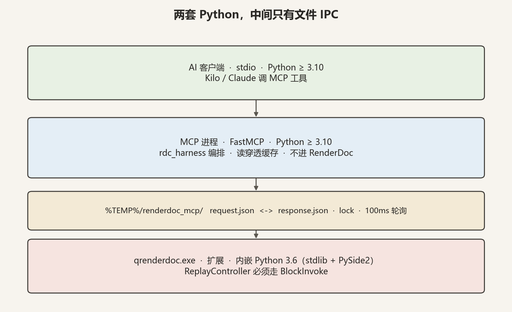
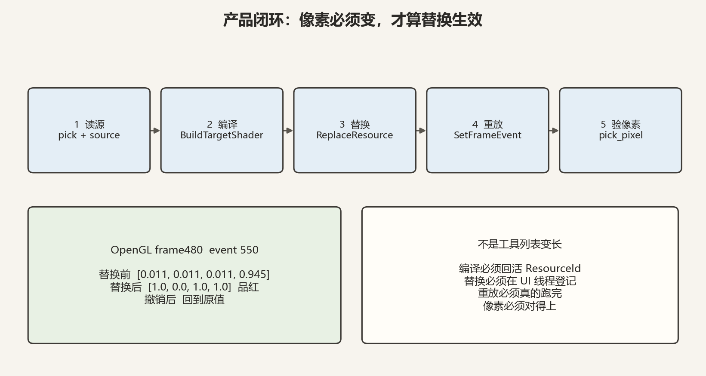
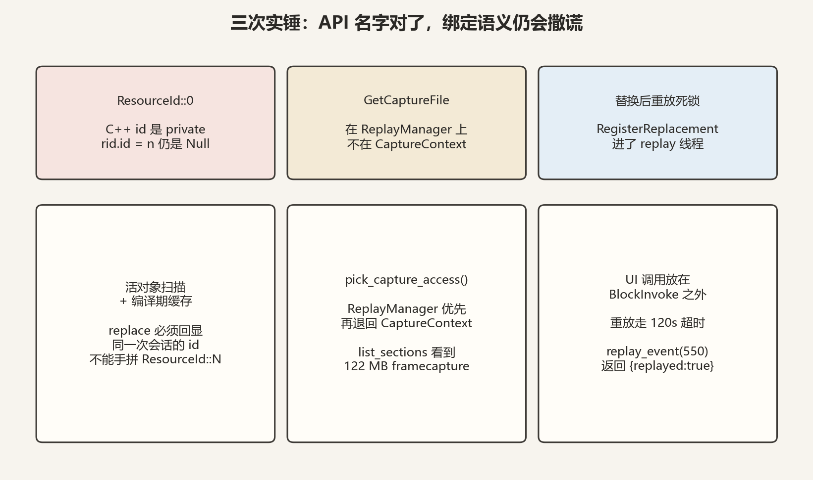
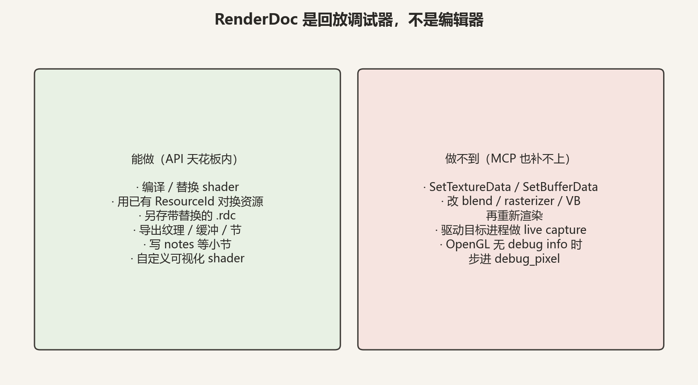

# 给 AI 接 RenderDoc，真正的产品不是工具列表

给图形调试器接 MCP，第一反应通常是把 Event Browser、Texture Viewer、Pipeline、Mesh Viewer 都做成工具。工具会很快超过五十个。那仍然不是产品。

产品是这一件事：在一份已经打开的 `.rdc` 里，改一段 shader，重放一帧，像素真的变了。

RenderDocMCP 在 OpenGL 捕获 `frame480` 上把这件事跑通了。替换前中心像素是 `[0.011, 0.011, 0.011, 0.945]`；编译一份品红 fragment、替换、重放 event 550 之后，变成 `[1, 0, 1, 1]`；撤销替换，像素回到原值。qrenderdoc 没有死，文件 IPC 没有卡死。

下面不是源码导读。是一组可以搬走的判断：两套 Python 为什么必须拆开，活 `ResourceId` 为什么不能手拼，UI 调用为什么不能进 replay 线程，以及 RenderDoc 的天花板在哪。

---

## 两套 Python，中间只有文件

RenderDoc 的扩展跑在 qrenderdoc 内嵌的 **Python 3.6** 上，标准库加 PySide2，没有 socket，也没有 QtNetwork。MCP 服务端和编排库跑在 **Python ≥ 3.10**，FastMCP、pydantic、现代注解。这两边不能互相 import。

所以通信不是端口，是 `%TEMP%/renderdoc_mcp/` 里的三个文件：`request.json`、`response.json`、`lock`。扩展侧 100ms 轮询。ReplayController 的每一次访问，都必须进 `BlockInvoke`。

把 IPC「修」成 socket，会在内嵌解释器里直接失败。把 `rdc_harness` 塞进扩展目录，3.6 解析不了注解。这不是风格问题，是进程边界。

人类 90% 的 RenderDoc 工作流——点像素、看 Pixel History、对一下 VS 输入和输出、查资源 usage——可以做成工具，而且应该做成工具。视觉问题优先 `pick_pixel` / `get_pixel_history`，网格问题优先 `get_mesh_data`，不要一上来把整张纹理读进 JSON。这些是入口，不是终点。

---

## 产品闭环：像素必须变

真正的闭环只有五步：读源、编译、替换、重放、验像素。`rdc_harness` 在 GPU 之外再叠两层验证：L1 是零模型成本的确定性规则（绑定、draw 预算、验证层消息）；L2 是像素 diff / PSNR / RT 哈希。编排器通过 `ShaderBackend` 协议对接 RenderDoc，所以单元测试不需要 GPU。

工具列表变长，证明不了替换生效。`replace_shader` 回一个 JSON，也不够。必须看到像素变。OpenGL `frame480` 上这件事复测过两次：第一次证明 hang-fix 之后能跑通；重启扩展再测一次，品红再次出现，撤销再次回到原值。

编译必须返回**同一次会话里的活 ResourceId**，不能手拼 `ResourceId::297`。替换必须在 UI 线程登记，才能在 Texture Viewer 里看见，也才能 `save_capture` 持久化。重放必须真的跑完——带真实替换的 OpenGL replay 不是 30 秒空操作，IPC 超时要给到 120 秒。

---

## 三次实锤：名字对了，语义仍会撒谎

第一轮对着 v1.45 Python 文档把 API 名字对上了，单元测试也是绿的。接到真捕获上，九个工具直接坏，七个降级，shader 编辑闭环完全没生效。问题不在文档拼写，在绑定语义。

**ResourceId::0。** C++ 里 `ResourceId.id` 是 private。Python 里写 `rid.id = 56`，对象看起来有数字，比较时仍是 Null。`get_texture_info` 能接受的 id，`get_resource` / `get_buffer_contents` / `export_texture` 全部失败。Hull / Domain 没绑 shader 时两边都是 Null，`Null == Null` 会误报命中。修法是扫描 `GetTextures` / `GetBuffers` / `GetResources` 的活对象，并把 `compile_shader` 返回的 id 缓存在本进程。

**GetCaptureFile 不在 CaptureContext。** MCP `LoadCapture` 之后 `ctx.GetCaptureFile()` 是 `None`。真正的入口在 `ReplayManager`：`ctx.Replay().GetCaptureAccess()`。九个「节 / 格式 / 转换」工具因此全军覆没。修法是 ReplayManager 优先、CaptureContext 兜底。修完之后 `list_sections` 能看见 122 MB 的 framecapture；`embed_dependencies` 和 `write_section` 会在打开的捕获里留下 `embeddedexternalfiles` 和 `renderdoc/ui/notes`。

**替换后重放死锁。** `replace_shader` 曾在 `BlockInvoke` 回调里调用 `RegisterReplacement`。那是 UI 线程的 `CaptureContext` 调用。下一次 `SetFrameEvent(force=True)` 时，replay 等 UI，UI 等 replay。qrenderdoc 死过一次；第二次卡到 30 秒 IPC 超时，后面所有工具全部超时。空重放没有替换，是好的——所以这不是「replay 本身慢」，是线程放错了。修法是：`RegisterReplacement` / `UnregisterReplacement` 放在 `BlockInvoke` **之外**，与已经写对的 `replace_resource` 对齐；replay 类工具走 120 秒超时。

这三件事的共同教训：对着文档写绑定，只能证明你调用了那个名字。活对象、线程归属、私有字段，必须拿到真 GPU 上才暴露。

---

## 天花板不在 MCP 层

RenderDoc 是回放调试器，不是编辑器。MCP 只能接到 API 允许的地方，不能把调试器变成 DCC。

能做的集合已经铺到边上：`BuildTargetShader` / `BuildCustomShader`，`ReplaceResource` + `RegisterReplacement`，`SaveCaptureTo`，导出纹理和缓冲，写 notes / bookmarks 这类小节。OpenGL 上 `list_shader_encodings` 必须给出 `GLSL` 这个名字，而不是枚举序数 `"2"`。`convert_capture` 必须把活的 `CaptureFileFormat` 交给 `ExportCapture`，不能塞一份 JSON 字典。这些都已在 `frame480` 上留下文件：品红像素、3523 字节的 PNG、108 万字节的 XML（文件头是 `<driver id="2">OpenGL</driver>`）。

做不到的集合同样硬。没有 `SetTextureData` / `SetBufferData`，不能往纹理或缓冲里写新字节，只能拿捕获里已经存在的 ResourceId 对换。不能改 blend / rasterizer / 顶点缓冲再重新渲染。扩展也驱动不了目标进程去做 live capture。OpenGL 捕获没有 debug info 时，`debug_pixel` 会直接说 unavailable；`compile_flags="debug"` 是 D3DCOMPILE 那一套，不会给 GLSL 造调试符号。`get_section` 拒绝超过 4 MiB 的节，是为了不把 122 MB framecapture 读进 Python 3.6——这是设计，不是故障。

想「写新字节」，有一条研究路径：在已经把目标绑成 UAV 的 dispatch 上，替换成一份计算 shader 去物化数据。绑定跟的是**原** shader 的 reflection，换一份 I/O 不同的 writer，往往会静默 no-op。所以它还停在研究，没有做成工具。

---

## 重复读取不该每次都进 GPU

大约六十个工具，默认每一问都走文件 IPC，再进 `BlockInvoke` / GPU。同一份捕获上反复问「event 550 的管线状态」，不该每次都重放。

缓存只放在 MCP 侧。键是捕获身份 + 方法 + 规范化参数。捕获身份用文件路径叠 mtime 和大小，避免两份 `.rdc` 里碰巧相同的 `event_id` 串数据。确定性只读命中后不再进 IPC；会改捕获状态的调用（`replace_shader`、`open_capture`、`write_section`）成功后清空缓存。会排空队列的 `get_debug_messages`、以及导出和单步调试，永不缓存。

默认是进程内内存。可选后端把条目写到 OpenViking 的 `viking://` 文件系统，MCP 重启之后还能命中；SDK 不在就退回内存。缓存进不了扩展目录——那是 Python 3.6 边界的另一面。

---

## 能搬走的，是这四句

1. **扩展锁在 3.6，编排锁在 3.10。** 中间用文件，不要 socket，不要跨进程 import。
2. **不要伪造 ResourceId，不要在 CaptureContext 上找 GetCaptureFile。** 活对象和 ReplayManager 才是绑定真相。
3. **UI 登记放在 BlockInvoke 之外。** 否则下一次强制重放会把单线程 IPC 一起带走。
4. **完成标准是像素变了。** 工具列表、JSON 回显、单元测试全绿，都替代不了一次真 GPU 上的 before / after。

树叶会改名：服务怎么拆、缓存后端换成谁、工具再加几个。根如果错了——把现代 Python 塞进扩展、把 `rid.id = n` 当成解析、把 `RegisterReplacement` 放进 replay 回调——叶子写得再整齐，接到真捕获上仍会在同一处裂开。

仓库在 [github.com/yhyu13/RenderDocMCP](https://github.com/yhyu13/RenderDocMCP)。对照源码时，扩展在 `renderdoc_extension/`，编排在 `rdc_harness/`，MCP 在 `mcp_server/`，OpenGL 实测记录在 `live-tool-validation-frame480.md`。
