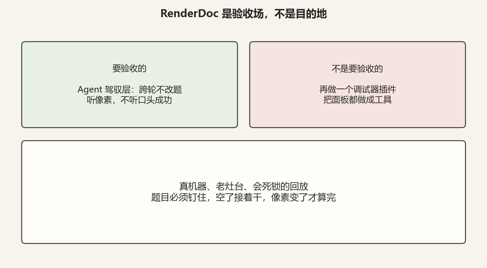
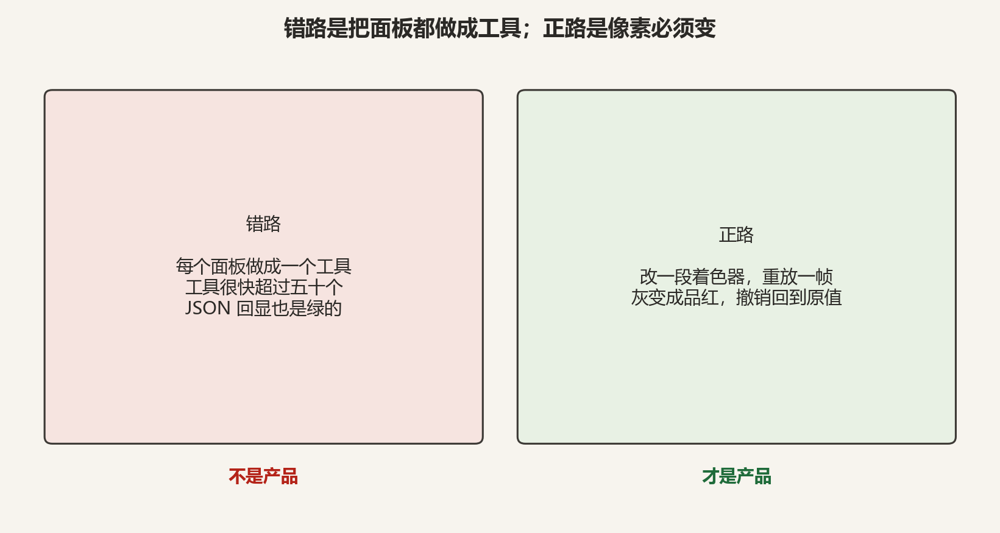
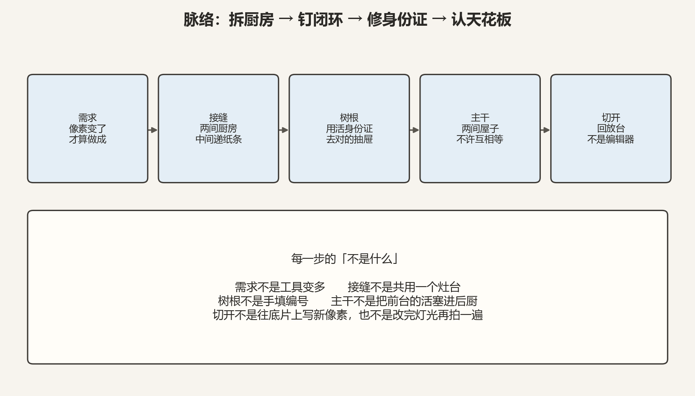
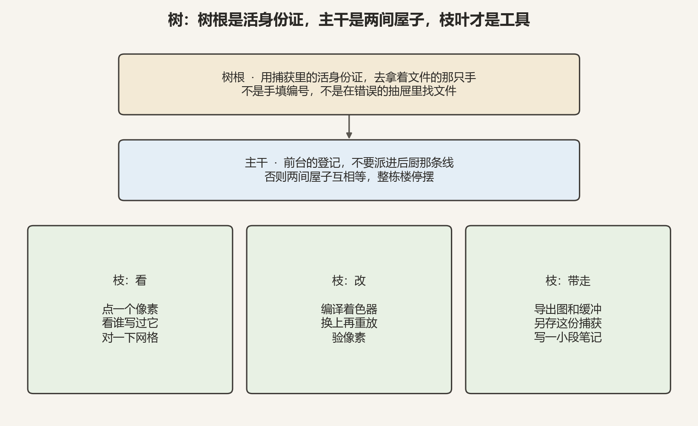
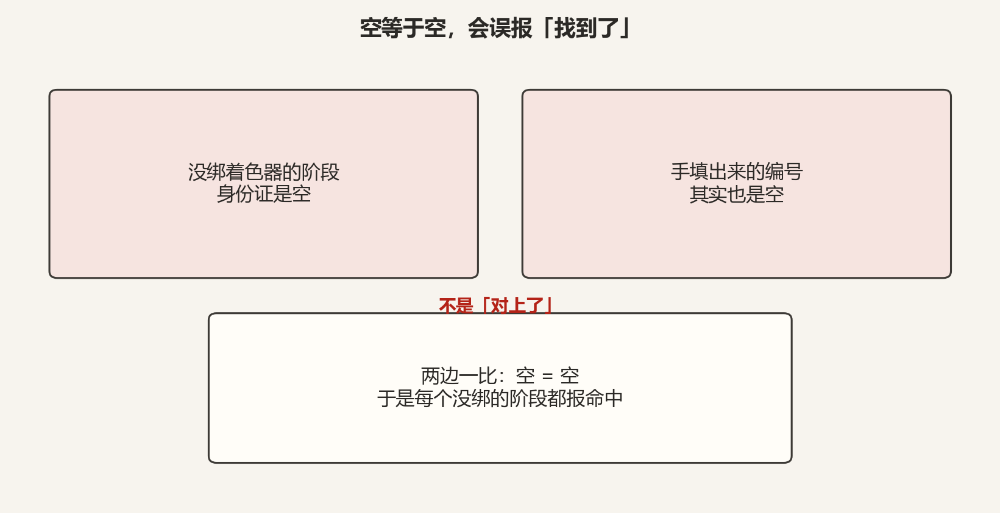
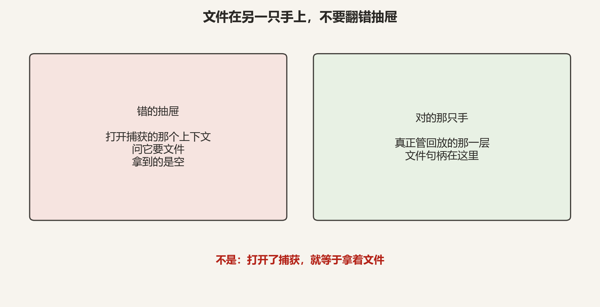
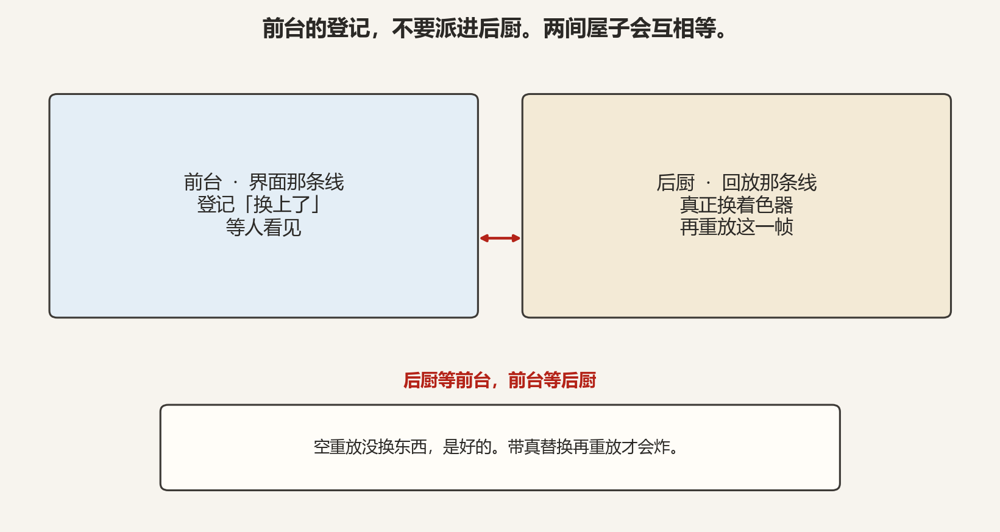
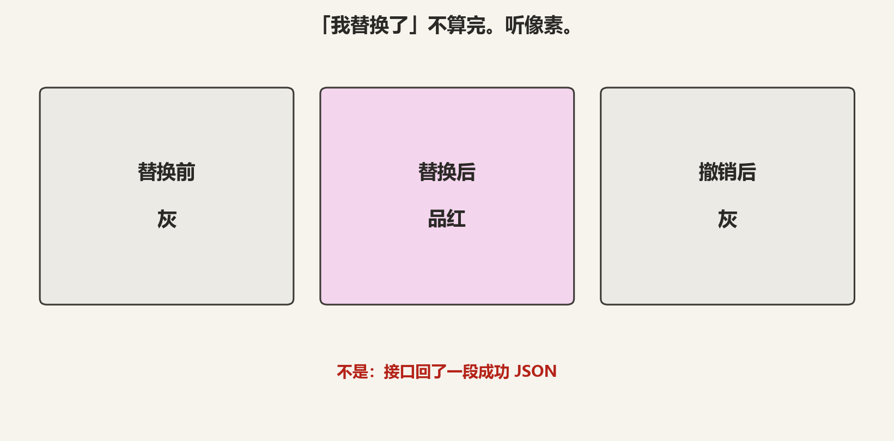
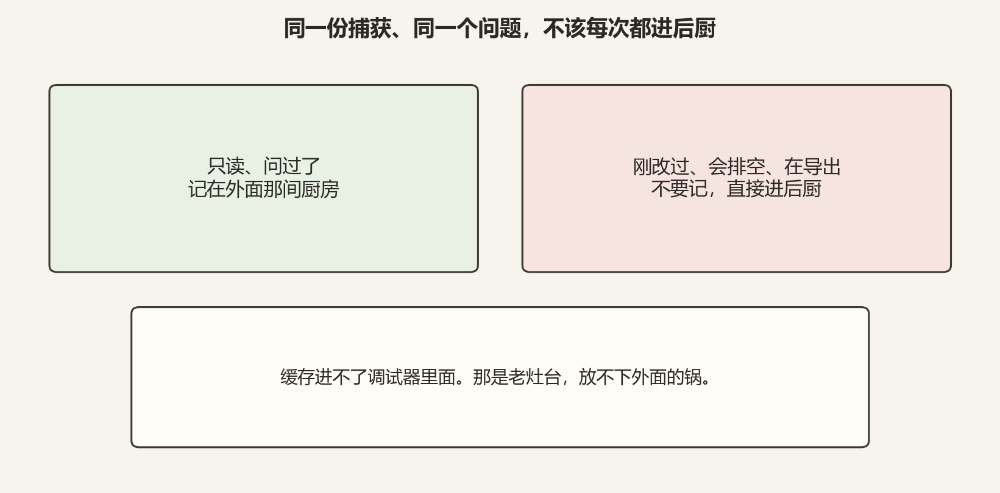
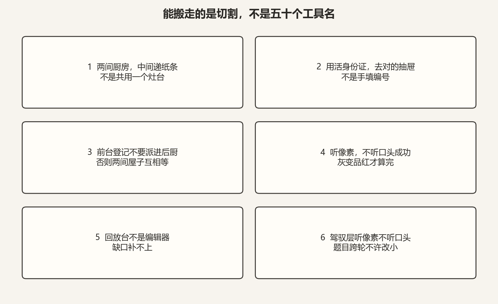

# 给 AI 接 RenderDoc，真正的产品不是工具列表

先花三句话，把这篇要聊的东西摆到台面上，不然下面的内容会读不懂。

**RenderDoc** 是一个图形调试器。游戏或渲染程序在跑的时候，它能把某一帧画面上 GPU 干的每一件事都录下来，存成一个文件（.rdc）。你之后可以打开这份"录像"，逐条回放，看某个像素到底是谁画的、某段着色器写成了什么样。

**MCP**（Model Context Protocol）是一套让 AI 客户端能调用外部工具的协议。把它接上 RenderDoc，意思就是：让 AI 能像人一样去操作这个调试器——打开捕获、查像素、改着色器、重新回放。

**驾驭层**（harness）这个词听起来玄，说白了就是"管住 AI 别偷懒、别自欺"的那套约束。我们要验证的是四件事：它能不能把任务从头到尾钉住不改小；干到一半没材料了，会不会自己接着干；它嘴上说"我做完了"，到底算不算数；卡住一轮，会不会当场就认输。

这三样凑到一起，就引出了全文唯一一句主题：

> **像素没变，产品没做成。题目改小了，驾驭层也没做成。**

用人话翻译一遍：我们不是要给 RenderDoc 再做一个插件，也不是要比谁的 MCP 工具列表更长。我们要的是一块够硬的场地，把"驾驭 AI"这件事按到真 GPU 上验收——目标不许缩水，完工听像素、不听嘴。

下面按这个顺序讲。每一步先说它是什么，再说它不是什么。

---

## 一、为什么费这个劲

先问一句：缺一个 RenderDoc 插件吗？不缺。

缺的是一块足够脏、足够真实的场地，把驾驭层按到真机器上。干净的单元测试里，什么问题都测不出来——因为题目是你出的，答案是你判的，Agent 干得再糊弄，测试也照样绿。

真到 GPU 上就露馅了：测试全绿，但像素压根没变；接口名字全对，但那个编号其实是空的；让 AI 接着干，它已经把题目从"完全控制读写"偷偷缩成了"再加两个工具"。

**是**：选一块脏场地——两套互不相认的 Python、靠文件递纸条、真实的捕获、像素前后对比——把驾驭层一路跑到"灰变品红"为止。

**不是**：为了再多五十个工具。也不是为了把模型调得更会点调试器。

---

## 二、最容易走错的路

给图形调试器接 AI，第一反应几乎都是同一件事：**把每个面板都做成一个工具。**

把 Event Browser 做成一个工具、把 Texture Viewer 做成一个工具、把 Pipeline 做成一个工具……人平时点的那几个窗口，全搬进 AI 能调用的接口。这条路走得飞快，也死得飞快：工具很快超过五十个，可像素纹丝不动；接口回显一段绿色的 JSON，可那段 JSON 里啥都没发生。

**是**：在已经打开的捕获里，改一段着色器、编译、换上、重放一帧、看像素。灰变成品红，撤销回到灰——这五步走完，才算一个产品。

**不是**：工具列表变长。也不是接口回一句"成功"就算数。

---

## 三、整件事的一条主线

后面的内容不散，是因为它沿着一条链往下走。上一步如果走了"不是什么"（比如把面板都做成工具），后面实现得再漂亮也会裂。

| 步 | 是什么 | 不是什么 |
|---|---|---|
| 需求 | 拿真 GPU 验收驾驭层：题目钉住，像素变了才算完 | 再做一个插件；工具变多；口头成功 |
| 接缝 | 两间厨房，中间递纸条 | 共用一个灶台；把新锅塞进老灶 |
| 树根 | 用活身份证，去对的抽屉拿文件 | 手填编号；打开了捕获就当拿着文件 |
| 主干 | 前台的登记放在后厨做完之后 | 把前台的活派进后厨那条线 |
| 切开 | 回放台能换着色器、对换、带走 | 往底片写新像素；改完灯光再拍一遍 |

这张表先存着，后面每一节都会回来对一次。

---

## 四、从一棵树看全貌

整个系统不是一排并列的按钮，而是从"绑定真相"长出来的一棵树。红字是"不是什么"。每片叶子只干它那根枝的活，不另开一根主干。

横着切下来的两条纪律——**两间厨房不许混灶**、**完成标准是像素**——约束的是整棵树，不是单独哪根枝。

---

## 五、第一道缝：两间厨房，中间只递纸条

这是整个项目最反直觉、也最不能"优化"掉的地方。

RenderDoc 内部跑着一个它自带的 Python，又老又封闭：**没有网口**，而且所有回放操作必须派到它指定的那条线程上，再等它干完。而外面的 AI 服务是现代 Python：负责编排、缓存、说话。

这两个环境根本不能互相 import。你把外面的库塞进调试器目录，老解释器读都读不懂——不是风格问题，是两个灶台压根不通用。

所以通信不能走端口，只能走临时目录里的三张纸条：`request.json`（请求）、`response.json`（应答）、`lock`（正在写）。里面百分之一秒轮询一次，看有没有新纸条。

**是**：两套运行时，中间一份约定好的纸条协议。

**不是**：把它改成网口（里面压根没有 socket）。也不是把外面的库塞进去。

顺便说一句：人平时在调试器里做的那 90%——点一个像素、看谁写过它、对一下网格——完全可以做成工具，也应该做。视觉问题先 `pick_pixel` 点一个点，网格问题先看一小段，不要一上来把整张图读进对话。这些是入口，不是终点。

---

## 六、树根：身份证和抽屉

捕获里每张图、每段缓冲、每份着色器，都有一张"身份证"——一个内部的资源编号（ResourceId）。坑就在这：**它不是你能手填的整数。**

底层字段是私有的。你在外面写上一个数字，对象看起来有编号了，比较的时候它其实还是空。

于是出现一个很阴的 bug：没绑着色器的阶段，身份证是空；你手填出来的编号，其实也是空。两个"空"一比，`空 == 空`，于是每个没绑的阶段都报"命中了"。

**是**：去捕获里扫描还活着的对象，对上那张真的身份证；编译刚发回来的那张，当场记住，下一句接着用。

**不是**：按文档拼一个编号。文档只能证明你喊对了名字。

文件是同一类错。打开了捕获，不等于手里就拿着文件。问"打开捕获的那个上下文"要文件，拿到的是空；真正拿着文件的，是管回放的那一层。九个"读节、看格式、做转换"的口子，曾经一起死在这只空手上。

**是**：去管回放的那一层拿句柄。

**不是**：打开了捕获，就当文件在手里。

---

## 七、主干：前台的活，不要派进后厨

"前台"是界面那条线（UI 线程），"后厨"是回放那条线。回放必须派到后厨那条线上，再等它做完。

有一个活是"前台"的：把"换上了"这个状态登记下来，好让人在画面里看见、好另存。这个活要是派进后厨，两间屋子就会互相等——后厨等前台登完记，前台等后厨做完回放。第一次调试器直接死掉；第二次整栋楼停摆，后面每张纸条都超时。

这里有个关键判断：**空重放（没换东西）是好的**。所以问题不是回放本身慢，是活派错了屋。

**是**：后厨只做替换和重放；登记放在后厨做完之后，回到前台再做。重放要给够时间——带真替换的一帧，不是随手点一下。

**不是**：在回放回调里顺手登个记。也不是把超时当成"回放坏了"。

---

## 八、闭环和证据：听像素，不听口头

真正的闭环只有五步：**读源 → 编译 → 换上 → 重放 → 验像素。**

编译必须交回**这一次会话里刚做出来的那张活身份证**，不能手抄编号。换上必须让前台也知道，人才能在画面里看见，也才能另存。重放必须真的跑完。

验证可以做两层：一层是不花钱的死规则（帧预算、draw call 数量、验证层消息），一层是像素差、信噪比、画面指纹。这两层可以在没有显卡的机器上跑，但它们**替代不了**显卡上那一次真正的回放。

同一份 OpenGL 捕获、同一个画面中心，这件事我们实打实跑通过两轮。

**是**：灰变成品红，撤销回到灰。调试器没死，纸条没卡住。

**不是**：接口回了成功。也不是测试全绿。

三次实锤可以收成一张对照——手填编号、翻错抽屉、活派错屋，修法分别是对活对象、去对的手、登记放在后厨之后。

对着文档写绑定，只能证明你喊对了名字。活对象、抽屉在谁手里、活该派哪间屋，必须拿到真机器上才暴露。

---

## 九、天花板：这是回放台，不是编辑器

必须老老实实说清楚一件事：调试器回放的是**已经录好的一帧**。它不是内容生产工具。接线层只能接到它允许的地方，不能把它变成编辑软件。

**能做到的**已经铺到边上了：换一份着色器再看、用已经存在的资源对换、另存、导出、写一小段笔记。这些都在真捕获上留下过痕迹——品红像素、一张小图、一份能认出是 OpenGL 的导出。

**做不到的**同样硬：没有往底片上写新像素的口子，只能拿已经在捕获里的东西对换；不能改混合、光栅、顶点数据再重新画一遍；也替不了游戏重新录一帧。没有调试符号时，逐步盯一个像素会直接说"做不到"——那不是接线漏了，是这份捕获没带符号。

过大的内部节拒绝整段读进来，是为了不把一百多兆一次性灌进内存。这是设计，不是故障。

**缺口在调试器。接线层补不上。**

---

## 十、树叶：同一问，不该每次都进后厨

大约六十个口子，默认每一问都递纸条、进后厨。可同一份捕获上反复问同一件事，不该每次都重放一遍。

于是把答案记在**外面那间厨房**。只记确定的只读结果；刚改过的、会排空队列的、正在导出或单步的，一律不记。

**是**：命中了就不再进调试器。

**不是**：把缓存塞进老灶台。那是 Python 边界的另一面，放不下外面的锅。

---

## 十一、收获与结论

树叶会改名，口子会再加。能抄走的是下面这六句。

**收获**

1. **RenderDoc 是验收场，不是目的地。** 要验收的是驾驭层，不是再做一个插件。
2. **产品是像素变了。** 不是工具变多，也不是口头成功。
3. **题目跨轮不许改小。** 空了接着干，每一轮把完整题目再念一遍，不是缩成"再加两个工具"就算往前走。
4. **"我做完了"不算完。** 听像素。卡住要连续出现，才允许认输。
5. **两间厨房、活身份证、前台不进后厨。** 不是共用灶台，不是手填编号，不是把登记派进回放线程。
6. **这是回放台，不是编辑器。** 缺口在调试器，接线层补不上。树根错了，叶子会在同一处裂开。

**结论**

给 AI 接图形调试器，不是把每个面板做成工具。是选一块够脏的场地，把驾驭层按到真机器上：题目钉住、空了续跑、不改题、听像素。灰变品红、撤销回到灰，这一趟才算验收过。能抄走的是这套切割，不是五十个工具名。

**PS.** 如果你只带走一句：**像素没变，产品没做成；题目改小了，驾驭层也没做成。**

**PPS.** 这和"把模型调得更会点调试器"不是一回事。提示词只能引导该问哪一步；跨轮不改题、听工作区不听口头，是驾驭层的合同，不是把模型训得更听话。

**PPS.** 文里的口子名、等待秒数都会过时。如果你在自己的系统里把新运行时塞进嵌入解释器、把手填编号当成解析、把前台的活派进后厨——或者测试一绿就宣布目标完成——接到真机器上，会在同一处裂开。那才是这篇要拦的事。
